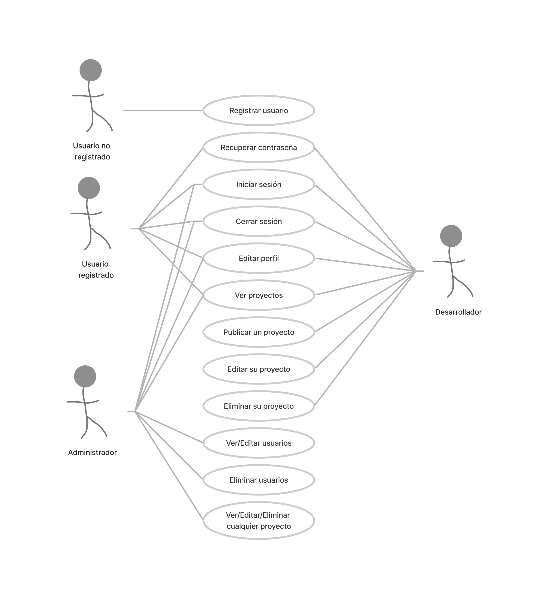

# Documentación
## Escenario del proyecto
**Vanilla Games S.L.** es una empresa de desarrollo de **minijuegos para navegadores web**, creados con vanillaJS, es decir, desarrollados exclusivamente con **Javascript** como lenguaje de programación (sin frameworks)

En esta empresa trabajan 10 desarrolladores y, habitualmente, suelen tener a tres alumnos/as en prácticas, de los cuales, al menos uno, tendrá muchas posibilidades de formar parte del equipo de desarrollo al acabar su etapa de formación.

El método de trabajo que se utiliza en dicha empresa consiste en proponer a cada uno de los miembros del equipo el desarrollo de un minijuego que, al acabar, deberán compartir con el resto de sus compañeros. Estos, a su vez, deben comentar y valorar cada una de las propuestas. Finalmente, en la empresa hay un equipo responsable de seleccionar aquellas propuestas que muestran un mayor potencial, para ser desarrolladas de manera definitiva por todo el equipo de trabajo, con el fin de crear una aplicación para su posterior comercialización.

Hasta la fecha, para el proceso de publicación de proyectos, comentarios y valoración utilizaban algunas herramientas ofimáticas, tipo hoja de cálculo de google. Actualmente **pretenden crear una aplicación web tipo intranet** para llevar a cabo este propósito.

Como alumno en prácticas, **tu trabajo consiste en crear una aplicación web** que permitirá a los desarrolladores de Vanilla Games, publicar sus propuestas de minijuegos, de manera que el resto de compañeros podrá hacer comentarios y emitir una valoración de cada proyecto publicado en esta plataforma.

## Requisitos del proyecto y casos de uso general

Los **casos de uso** son una técnica de modelado utilizada en el desarrollo de software para describir las interacciones entre un sistema y sus usuarios. En términos simples, los casos de uso describen cómo los usuarios interactúan con un sistema y qué resultados esperan obtener de él.

### Casos de uso general

Esta aplicación web debe permitir a un usuario **registrarse** (con su nombre, apellidos, email y contraseña) y posteriormente **iniciar** y **cerrar** sesión. Un usuario registrado debe poder **ver un listado de proyectos** publicados por los desarrolladores. También podrá **editar su perfil** y **subir una imagen** de tipo avatar.

Si el usuario registrado tiene el perfil de **‘desarrollador’** , además, debe poder **publicar proyectos** con información del tipo: nombre de proyecto, una descripción, una imagen representativa y dos enlaces, el del proyecto desplegado en un servidor de pruebas y el del repositorio del código correspondiente, el estado del proyecto, etc. También debe poder **eliminar o editar sus proyectos**.

Por otro lado, el perfil desarrollador debería poder **realizar comentarios** de cada uno de los proyectos publicados y añadir una valoración en forma de estrellas.

Finalmente, habrá un administrador que podrá **adminstrar el perfil** de cada uno de los usuarios registrados en la plataforma (editar, borrar, etc) así como modificar el rol de cada uno de estos. También tendrá **control total sobre los comentarios y valoraciones.**

## Requesitos y diagrama de casos de uso

En la introducción de esta documentación, en la sección El proyecto Vanilla Games, en concreto en el apartado Requisitos del proyecto y casos de uso general, hemos definido qué se espera de nuestra aplicación web, a partir de los 'Casos de uso general'.

También hemos dividido todo el trabajo de desarrollo en diferentes versiones, con la intención de que nuestro proyecto esté operativo desde el inicio de su implementación, de manera que conforme evolucione a posteriores versiones, aumentaremos su nivel de funcionalidad.

**Por lo tanto, vamos a comenzar por la versión 1.0.**

Lo primero es definir los **casos de uso para esta versión.** Una primera aproximación podría ser la siguiente:

### Casos de uso para la V1.0 - Definición básica

1. **Registrar usuario**: Un usuario puede registrarse en la plataforma proporcionando su nombre, apellidos, email y contraseña. 
2. **Recuperar contraseña**: Un usuario registrado puede solicitar la recuperación de su contraseña en caso de que la haya olvidado. Para ello, se le enviará un correo electrónico con las instrucciones para restablecer su contraseña. 
3. **Iniciar sesión**: Un usuario registrado puede iniciar sesión en la plataforma proporcionando su email y contraseña. 
4. **Cerrar sesión**: Un usuario puede cerrar su sesión en la plataforma en cualquier momento. 
5. **Editar perfil**: Un usuario registrado puede editar su perfil, actualizando su nombre, apellidos, email o contraseña. 
6. **Ver proyectos**: Un usuario registrado puede ver un listado de proyectos publicados por los desarrolladores. 
7. **Publicar proyecto**: Un usuario con el perfil de desarrollador puede publicar un proyecto proporcionando información como nombre, descripción, imagen representativa, enlaces a servidor de pruebas y repositorio de código, estado del proyecto, etc. 
8. **Editar proyecto**: Un usuario con el perfil de desarrollador puede editar un proyecto que haya publicado previamente, actualizando la información del proyecto. 
9. **Eliminar proyecto**: Un usuario con el perfil de desarrollador puede eliminar un proyecto que haya publicado previamente. 
10. **Ver/Editar usuarios**: Un adminsrador puede ver una tabla con todos los usuarios que hay registrados y editar la información, incluido el ROL de usuario. 
11. **Eliminar usuario**: Un administrador puede eliminar cualquier usuario registrado en la plataforma.

### Diagrama de casos de uso

Para tener la información de manera gráfica vamos a utilizar uno de los **diagramas UML** que aprendimos a hacer el curso pasado:

#### Diagrama de casos de uso para la versión 1.0

Este diagrama refleja de forma resumida qué acciones se pueden llevar a cabo en nuestro aplicación dependiendo del rol del usuario.

Ahora que tenemos claro todo **lo que debe hacer la versión 1.0**, nuestra misión ahora es **planificar el trabajo** que se nos viene encima...
