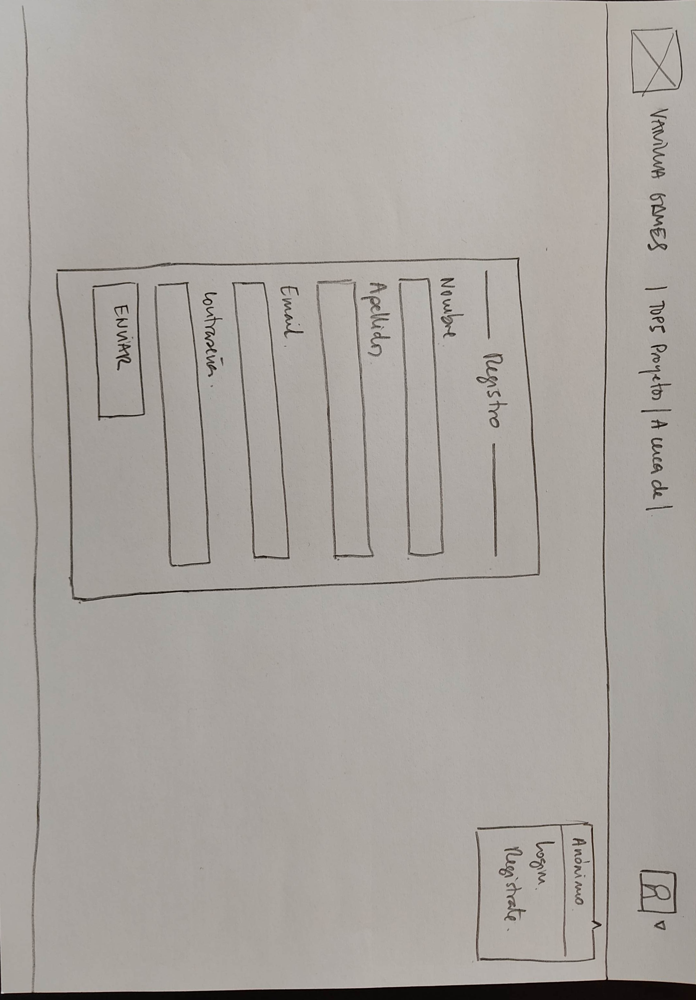
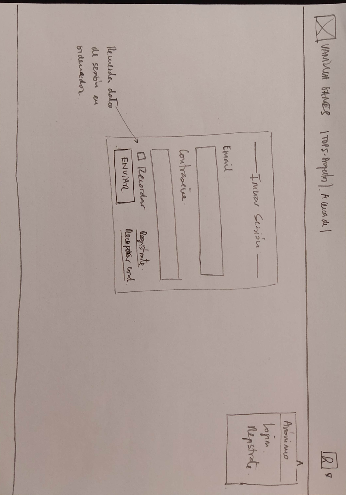
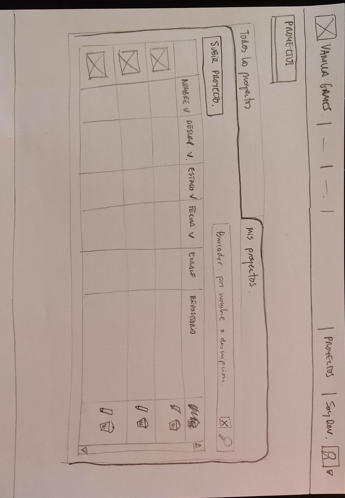

# Documentación Sprint 1

## Diseño de Bocetos

### Home y menús usuarios

Hemos didivido la interficie en 3 zonas, el encabezado (header), el cuerpo principal (main) y el pie de página (footer).

- En el **header** vamos a alojar una barra superior fija con: el **logo** y nombre de la web (que hará las veces de link a la página principal), un **menú central genérico** (para acceder a páginas públicas), un menú central específico (que será diferente en función del rol de usuario logueado), y un icono (**avatar**) que permitirá ver la imagen del usuario logueado y que hará de botón para desplegar otro menú, el **menú de usuario** (que tendrá diferentes items dependiendo de si la sesió está abierta o no y del tipo de rol que tenga el usuario logueado).
- El **cuerpo (main)** albergará el contenido de las páginas. Será la sección que vaya cambiando dependiendo de la página que carguemos. En la página home simplemente aparece una imagen de fondo y el nombre de la web.
- El **header** será meramente informativo.

### Regitro de un usuario

### Iniciar sesión

### Editar mi perfil

Editar perfil será una ventana modal, es decir, se mostrará la ventana y el fondo se volverá oscuro.

Esta ventana de edición permitirá, además de modificar los datos del usuario, **añadir una imagen de avatar**. Por el momento, en esta primera versión, podremos añadir el link de una imagen que esté alojada en un servidor. En la siguiente versión (versión 1.1) actualizaremos esta ventana para que puedan **subirse archivos** (imágenes) al servidor.

### Listado de todos los proyectos

En esta página podemos ver, en la pestaña izquierda, todos los proyectos en forma de tabla. La pestaña derecha mostrará solo los proyectos que ha subido el usuario que ha iniciado la sesión.

Al hacer clic en cualquier parte de la fila se accede al detalle del proyecto.

También tenemos un buscador que permite buscar proyectos por palabras clave en el nombre o descripción.

Las celdas de encabezado de las tablas incluyen un icono (flecha hacia arriba o hacia abajo) que permitirá ordenar la tabla por la columna en concreto.

### Listado de Mis proyectos

En esta pestaña podemos ver los trabajos pertenecientes al usuario logueado. En cada fila aparece, además, un icono para editar y borrar el proyecto correspondiente. Por otro lado tenemos la opción de subir un nuevo proyecto.

_Habría que valorar si es mejor crear un único buscador para el nombre y descripción del proyecto o dos barras de busqueda, una para cada sección, tal y como se muestra en el boceto anterior._

### Detalle de un proyecto

Si el usuario que está viendo la información de un proyecto en concreto es el autor de dicho proyecto, aparecerá un icono para la edición del mismo.

### Nuevo proyecto / Editar un proyecto

Esta vista sirve tanto para crear un nuevo proyecto como para editarlo.

Si el proyecto es nuevo, el botón mostrará el texto _ENVIAR_, pero si estamos editándolo aparecerá el texto ACTUALIZAR. Al crear o actualizar el proyecto, la web nos reenvía a la vista 'Detalle de proyecto'.

### Panel administración de proyectos

Si tienes el rol '**administrador**' aparecerá el item '_Panel administración_' en el **menú superior específico**. Este item nos permite cargar la vista '**Panel administración de proyectos**'. Desde esta vista también podemos acceder al 'Panel administración de usuarios'.

Esta vista permite **editar o borrar cualquier proyecto** haciendo click en los iconos correspondientes. La opción editar nos llevará a la vista '_Editar proyecto_'

### Panel administración de usuarios

Esta vista permite **editar los datos de los usuarios.** Por supuesto es solo accesible para los administradores.

En esta vista, el método para editar la información es diferentes. Aquí los datos **aparecen sobre 'inputs'**, de manera que al hacer clic sobre ellos, aparecerá el cursor de edición. Se pueden modificar todos los datos (en especial el '_estado_' y el '_rol_' del usuario) excepto el email.
