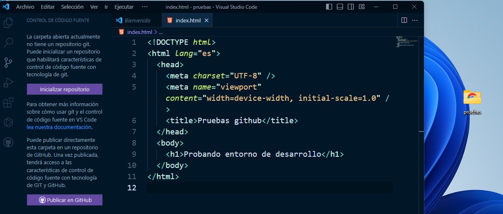
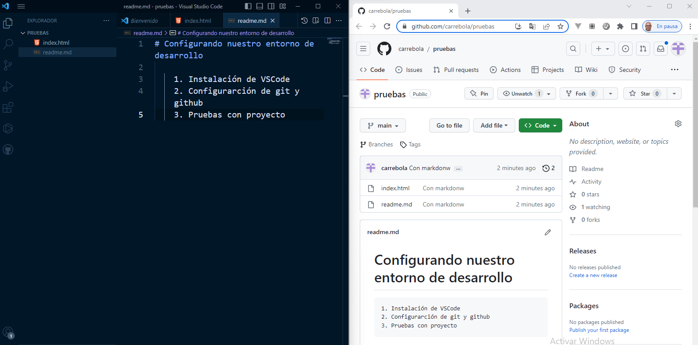

# Documentación Sprint 2

## Comenzamos el SPRINT 2 - PROTOTIPOS

Comenzamos el sprint 2 que incluye tres historias: La configuración del entorno de desarrollo, la maquetación de los bocetos y la implementación de la validación de los formularios.


*“Dame seis horas para cortar un árbol y pasaré las primeras cuatro afilando el hacha.” – Abraham Lincoln*

Si queremos ser eficientes en la creación de aplicaciones web, lo mejor es empezar por configurar bien nuestro entorno de desarrollo.
Para ello vamos a instalar/configurar las siguientes herramientas:
1. Un buen software para escribir nuestro código. En nuestro caso usaremmos el programa **VSCode** de Microsoft.
2. Instalación del software para el control de versiónes. Nosotros instalaremos **GIT**.
3. Una aplicación web para sincronizar nuestro repositorio en la nube. En nuestro caso será **GitHub**.

## 1. VSCode

Sin duda, en le momento de escribir esta documentación, el rey de los IDs es, sin duda, Visual Studio Code (VSCode).

Os hago un resumen de algunas aspectos que debes tener en cuenta a la hora de instalar y configurar VSCode, y te pondré información ampliada ya que es un tema muy trillado en internet:

### 1.1. Descarga e instala VSCode 
[Puedes encontrar la versión oficial de vscode aquí](https://code.visualstudio.com/)

### 1.2. Elige el tema que más te guste. 
Puedes tunear tu VSCode instalando diferentes temas. Para ello:

- Desde el buscador de extensiones (ctrl + mayus + X) escribe el nombre del tema que quieres instalar.
- Haz clic en instalar extensión.
- Desde el icono de configuración de vscode (la tuerquecita de abajo a la izquierda) selecciona '**Temas > Tema de color**'
- Selecciona el tema que has instalado y... ¡ya lo tienes!

### 1.3. Instala un tema de iconos, por ejemplo [VSCode Icons](https://marketplace.visualstudio.com/items?itemName=vscode-icons-team.vscode-icons) o [Material Icon](https://marketplace.visualstudio.com/items?itemName=PKief.material-icon-theme)

Para instalar los iconos el proceso es el mismo:

  - Desde el buscador de extensiones escribe el nombre del tema de iconos
  - En configuración, selecciona '**Tema > Tema de icono de archivo**' y busca el tema instalado.
  - Ahora verás que en la columna de la izquierda, cada archivo tiene un icono diferente en función de su extensión: html, css, etc.

### 1.4. Extensiones

Con las extensiones puedes aumentar la potencia y mejorar tu flujo de trabajo. 
#### Prettier
Una de las extensiones que te recomiendo sí o sí es '**Prettier**'. Esta extensión se va a encargar de formatear tu código HTML y CSS port tí, respetando las identaciones.
El proceso para instalar esta extensión es muy simple, solo tienes que buscar la extensión en el buscador y darle a instalar.

#### Live Server
Otra extensión imprescindible para nosotros es **Live Server**. Mediante esta extensión podremos tener un servidor virtual que mostrará el resultado de nuestro trabajo en un navegador, con la ventaja de que la vista se irá actualizando conforme vamos modificando el código.

Existen infinidad de extensiones para VSCode
Aquí puedes ver un ejemplo de mi entorno. Utilizo el tema **Night Owl** y los iconos de **VSCode Icons**.
Fijate que el código html está formateado con **Prettier**



De momento, con esto es suficiente para comenzar a trabajar en el desarrollo de los prototipos html y css. Más adelante acabaremos de configurar nuestro entorno para trabajar con NodeJS y otras herramientas que nos ayudarán a programar de forma más eficiente.

## 2. Control de versiones - Git

Para el control de versiones vamos a instalar y configurar Git. Aunque seguro que a estas alturas ya sabes qué es Git, pero deja que te refresque algunas ideas importantes:

Vamos a instalar (si aun no está instalado) Git. Para ello:  
1. Descarga su última versión de la web oficial: [Download Git](https://git-scm.com/).
2. Instala en tu ordenador el software.
3. Configura git para tu usuario:
  
   - Lo primero que deberás hacer cuando instales Git es establecer tu nombre de usuario y dirección de correo electrónico. Esto es importante porque los "commits" de Git usan esta información, y es introducida de manera inmutable en los commits que envías:

  ```
    $ git config --global user.name "John Doe"
    $ git config --global user.email johndoe@example.com  
  ```
Sólo necesitas hacer esto una vez si especificas la opción --global, ya que Git siempre usará esta información para todo lo que hagas en ese sistema

## 3. Repositorio en linea - Github

Ahora que tenemos Git instalado en nuestro ordenador, vamos crearnos una cuenta en Github para poder sincronizar todo nuestro trabajo en la nube.

1. En primer lugar vamos a acceder [github.com](https://github.com/)
2. Crea una cuenta e inicia sesión.
3. Ahora vamos a crear un proyecto de prueba con vscode, craremos un repositorio y lo sincronizaremos con github.
   
## Configurando entorno y subiendo página de pruebas

Vamos a ver un ejemplo de todo el proceso. La idea es instalar y configurar nuestro entorno de desarrollo para después crear una página web, guardar una versión en git, subirla a github y publicarla en github pages. Vamos a por ello:

1. Instala VSCode si no la has hecho aún.
2. Configúralo con el tema que más te guste, los iconos que decidas e instala las extensiones **live server** y **prettier**.
3. Crea una carpeta en tu ordenador con nombre `pruebas`
7. Abre VSCode y arrastra la carpeta dentro de la ventana central.
8. Crea un archivo con nombre index.html (algo básico, con un h1 y poco más).
9. Muestra el resultado en el navegador utilizando **live server**.
4. Configura prettier para que al guardar con `ctrl + S` se aplique formateado de tu código. Pruebalo.
5. Instala Git si no lo has hecho aún.
6. Configura tu usuario o confirma que ya está configurado.
7. Haz clic en el icono de '**Control de fuente**' de tu vscode o pulsa `ctrl + Mayus + G`
8. Aparecerá un mensaje que te indica que no tienes repositorio creado, y te dará la opción de crearlo desde aquí. Hazlo
   
   

   

9. Escribe un mensaje de inicio de repositorio (por ejemplo '*primer commit de git*') y dale a confirmar.
10. Ahora te pedirá si quieres **publicar la rama** ('*Branch*'). Dile que sí. Al hacer clic te preguntará qué nombre quieres para el repositorio y si quieres que sea privado o público. Por defecto, el nombre del repositorio coincide con el nombre de la carpeta de tu proyecto, pero puedes cambiarlo si lo deseas. Para esta prueba haremos que nuestro repositorio sea público.
11. Si es la primera vez que conectas tu VSCode con github te pedirá que lo sincronices. Utiliza la opción de confirmar a través de VSCode.
12. Una vez publicado tu archivo en github podrás ver, en tu página de github (por ejemplo `carrebola.github.com`), algo así:



1.  Vamos a **documentar** de forma básica nuestro proyecto *prueba*. Para ello vamos ahora a crear un archivo **readme.md** para que github muestre información del proyecto publicado en su pantalla inicial:
  - Crea un archivo con nombre **readme.md** en la raiz de la carpeta del proyecto.
  - Escribe dentro un texto descriptivo del proyecto, como por ejemplo:
    
```
# Configurando nuestro entorno de desarrollo

1. Instalación de VSCode
2. Configurarción de git y github
3. Pruebas con proyecto

``` 
Si abrimos ahora github podemos ver como se muestra esta información en la portada del repositorio de github.


14. Para terminar vamos a subir nuestro proyecto a github pages. Para ello:
    - Haz clic en `Settings` (el icono con forma de engranaje de la parte superior)
    - Entra en Pages (opción que encontrarás en el menú lateral izquierdo)
    - Donde pone `Branch` selecciona la rama `main` y haz clic en `Save`.
    - Si todo ha ido bien, la página se está publicando... Espera un minuto y refresca la página con F5
    - Ahora puedes ver la url donde se ha publicado tu página. Haz clic en el enlace o en el botón `Visit site` y podrás ver la web publicada.


Y hasta aquí la configuración de nuestro entorno de desarrollo, al menos la versión básica. Más adelante aprenderemos a trabajar con otras herramientas como nodejs, eslint, etc, pero de momento, con este entorno, ya **estamos preparados para crear los prototipos en html y css** de la primera versión de nuestro proyecto.

## ¡¡¡ Comienza el juego !!! 

Ahora que tenemos el hacha afilado, es el momento de **comenzar a escribir el primer código de nuestro proyecto.**
Pero antes vamos a crear un proyecto nuevo en VSCode, a continuación crearemos un repositorio y lo vincularemos con github. Después crearemos una **rama** exclusiva para el diseño de los prototipos en html/css. Y ya estaremos listos para comenzar a picar código. Vamos a ello:

### Creando la rama principal
1. Crea en tu carpeta de proyectos una carpeta con nombre `vanillagames10`
2. Abre VSCode y arrástrala a la parte central de tu IDE
3. Crea un **repositorio** para el proyecto.
4. Crea el primer **commit** con el mensaje '*Commit principal*'
5. Publica la rama con el mensaje '*Rama principal*'
6. Publica el repositorio como **privado**
7. Ahora tienes un **proyecto** con una única **rama**, cuyo nombre por defecto es **main**. Vamos a crear un archivo readme.md para esta rama. Escribe en él el título '*Vanilla Games*' junto a un párrafo con la descripción del proyecto: '*Vanilla Games es el nombre que recibe el proyecto que vamos a desarrollar en esta documentación. Es un proyecto sencillo, en las versiones iniciales, que se irá complicando a medida que vayamos trabajando en él.*'.
8. Crea un segundo commit con el texto '*Creamos archivo readme.md para rama principal*'. A continuación sincroniza los cambios con github.
9. Abre ahora la página de github y comprueba que:
   1.  El proyecto se ha creado y subido con éxito en la rama **main**.
   2.  Se muestra la información del archivo **readme.md** en la página principal.
   3.  Se muestra el mensaje del **commit** que has hecho.


### Creando la rama prototipos
Vamos a crear una rama exclusiva para el diseño de los prototipos y a subirla a github. Sigue los siguientes pasos:
1. Crea una rama nueva con nombre *prototipos*. Para ello haz clic en el nombre de la rama actual 'main' que verás en la parta inferior izquierda de VSCode.
2. Selecciona `Crear rama...`
3. Vamos a ponerle el nombre '*prototipos*'
4. Fijate que ahora en la parte inferior izquierda aparece el nombre de la rama actual en la que estás trabajando.
5. Crea una carpeta en la raiz con nombre `prototipos`.
6. Ahora vamos a crear el archivo `home.html` (de momento pon un h1 con el título y poco más)
7. Y hacemos un **commit** con el texto '*Prueba prototipo home*'. Te pedirá si quieres publicar la rama, dile que sí y haz **push** (sincronziar con github).
8. Fíjate que ahora en github tienes las dos ramas, la rama `main`y la rama `prototipos`. En la rama main solo tienes el archivo `readme.md` pero en la rama `prototipos` ahora ya tienes la carpeta `prototipos`con el archivo `home.html`. 
   Es decir, ahora tienes un repositorio de tu proyecto pero con diferentes ramas que, por el momento, serán completamente independientes.


 8. Ya para acabar, puede ser interesante crear un archivo `readme.md` dentro de la carpeta `prototipos`. Hazlo y sube los cambios a github

