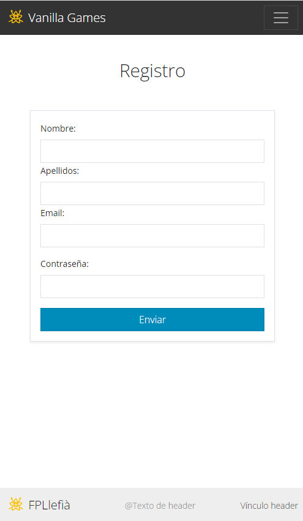

# Documentación Sprint 2
## *HOME Versíón escritorio* 


## *HOME Versíón móvil* 


## Entorno de desarrollo
Vamos a comenzar a maquetar los prototipos para nuestro proyecto.

En primer lugar abre el VSCode y arrastra tu carpeta del proyecto. Si no recuerdo mal, se llamaba `vanillagames10`

Ahora deberías ver en la parte inferior izquierda de vscode el **nombre de la rama en la que estás situado**. Deberías estar en la rama `prototipos`, si no es así, puedes cambiar de rama haciendo clic (con el botón izquierdo) sobre el nombre de la rama.


Si todo es correcto deberías ver en la columna izquierda la carpeta prototipos con un archivo `home.html` y un archivo `readme.md`.

Abre el archivo `home.html` y comencemos a trabajar...
## Procedimiento

Comenzamos a maquetar la página **home**. De manera resumida debemos seguir los siguientes pasos:
1. Creamos plantilla html
   1. Modificamos `lang` y `title`
   2. Vinculamos la libreria css para bootstrap y bootswatch
   3. Vinculamos la librería de iconos de boostrap
   4. Vinculamos el js de bootstrap.
2. Creamos la estructura de la web dentro del body con las etiquetas header, main y footer
2. Copiamos el componente menú de la documentación de bootstrap (**navbar**) y lo modificamos para que se ajuste a nuestro prototipo. Lo usamos tanto en el header como en el footer.
3. Creamos, en el main, un h1 y una imagen.

Aquí puedes ver el código utilizado: 👁‍🗨 ...

<div >

```html title="home.html"

<!DOCTYPE html>
<html lang="es">
	<head>
		<!-- Required meta tags -->
		<meta charset="utf-8" />
		<meta name="viewport" content="width=device-width, initial-scale=1" />

		<!-- Bootstrap CSS -->
		<link
			href="https://cdn.jsdelivr.net/npm/bootstrap@5.0.2/dist/css/bootstrap.min.css"
			rel="stylesheet"
			integrity="sha384-EVSTQN3/azprG1Anm3QDgpJLIm9Nao0Yz1ztcQTwFspd3yD65VohhpuuCOmLASjC"
			crossorigin="anonymous"
		/>
		<!-- Bootswatch CSS -->
		<link
			rel="stylesheet"
			href="https://cdn.jsdelivr.net/npm/bootswatch@5.3.0/dist/yeti/bootstrap.min.css"
		/>
		<!-- Bootstrap icons -->
		<link
			rel="stylesheet"
			href="https://cdn.jsdelivr.net/npm/bootstrap-icons@1.10.5/font/bootstrap-icons.css"
		/>
		<!-- Mis estilos personales  -->
		<link rel="stylesheet" href="styles.css" />

		<title>Vanilla Games</title>
	</head>
	
	<body class="pt-5" style="overflow-x: hidden; padding-bottom: 100px">
		<header>
			<nav class="navbar navbar-expand-lg navbar-dark bg-dark fixed-top">
				<div class="container">
					<a class="navbar-brand" href="#"
						>

						Vanilla Games</a
					>
					<button
						class="navbar-toggler"
						type="button"
						data-bs-toggle="collapse"
						data-bs-target="#navbarSupportedContent"
						aria-controls="navbarSupportedContent"
						aria-expanded="false"
						aria-label="Toggle navigation"
					>
						<span class="navbar-toggler-icon"></span>
					</button>
					<div class="collapse navbar-collapse" id="navbarSupportedContent">
						<ul class="navbar-nav mx-auto mb-2 mb-lg-0">
							<li class="nav-item">
								<a class="nav-link active" aria-current="page" href="#">Home</a>
							</li>
							<li class="nav-item">
								<a class="nav-link" aria-current="page" href="#">TOP5 Proyectos</a>
							</li>
							<li class="nav-item">
								<a class="nav-link" aria-current="page" href="#">A cerca de</a>
							</li>
						</ul>
						<ul class="navbar-nav ms-auto me-2 mb-2 mb-lg-0">
							<li class="nav-item">
								<button class="ms-2 btn btn-success">
									Iniciar sesión
									<i class="bi bi-box-arrow-in-right"></i>
								</button>
							</li>
							<li class="nav-item">
								<button class="ms-2 btn btn-outline-light">
									Regístrate
									<i class="bi bi-box-arrow-in-right"></i>
								</button>
							</li>
						</ul>
					</div>
				</div>
			</nav>
		</header>
		<main>
			<div class="container">
				<h1 class="mt-5 text-center fw-bold" style="font-size: 100px;">Vanilla Games</h1>
				<div class="m-5 mx-auto" style="max-width: 400px">
					
				</div>
			</div>
		</main>
		<footer class="">
			<nav class="navbar bg-secondary fixed-bottom small">
				<div class="container">
					<a class="navbar-brand fs-6" href="http://www.fpllefia.com">
						
						FPLlefià
					</a>
					<span class="navbar-text">DAW - Asignatura de proyectos</span>
					<a href="#" class="nav-link">carrebola GITHUB</a>
				</div>
			</nav>
		</footer>

		<!-- Option 1: Bootstrap Bundle with Popper -->
		<script
			src="https://cdn.jsdelivr.net/npm/bootstrap@5.0.2/dist/js/bootstrap.bundle.min.js"
			integrity="sha384-MrcW6ZMFYlzcLA8Nl+NtUVF0sA7MsXsP1UyJoMp4YLEuNSfAP+JcXn/tWtIaxVXM"
			crossorigin="anonymous"
		></script>
	</body>
</html>

```
</div>

## *REGISTRO Versíón escritorio* 


## *REGISTRO Versíón móvil* 




## Procedimiento

Para maquetar la página `registro.html` podemos partir de la página `home.html` haciendo una copia y modificando la etiqueta `main`. 

De manera resumida debemos seguir los siguientes pasos:
1. Modificamos la página home eliminando el botón *registro* del menú y el contenido de la etiqueta `main` excepto el h1 que modificaremos.
2. Cremos un div con una anchura máxima usando el atributo `style` y dentro creamos un formulario con los campos correspondientes.

Aquí puedes ver el código utilizado: 👁‍🗨 ...

<div >

```html title="registro.html"

<!DOCTYPE html>
<html lang="es">
	<head>
		<!-- Required meta tags -->
		<meta charset="utf-8" />
		<meta name="viewport" content="width=device-width, initial-scale=1" />

		<!-- Bootstrap CSS -->
		<link
			href="https://cdn.jsdelivr.net/npm/bootstrap@5.0.2/dist/css/bootstrap.min.css"
			rel="stylesheet"
			integrity="sha384-EVSTQN3/azprG1Anm3QDgpJLIm9Nao0Yz1ztcQTwFspd3yD65VohhpuuCOmLASjC"
			crossorigin="anonymous"
		/>

		<link
			rel="stylesheet"
			href="https://cdn.jsdelivr.net/npm/bootswatch@5.3.0/dist/yeti/bootstrap.min.css"
		/>

		<link
			rel="stylesheet"
			href="https://cdn.jsdelivr.net/npm/bootstrap-icons@1.10.5/font/bootstrap-icons.css"
		/>
		<link rel="stylesheet" href="styles.css" />

		<link rel="stylesheet" href="styles.css" />
		<title>Registro</title>
	</head>
	<body class="pt-5" style="overflow-x: hidden; padding-bottom: 100px">
		<header>
			<nav class="navbar navbar-expand-lg navbar-dark bg-dark fixed-top">
				<div class="container">
					<a class="navbar-brand" href="#"
						>

						Vanilla Games</a
					>
					<button
						class="navbar-toggler"
						type="button"
						data-bs-toggle="collapse"
						data-bs-target="#navbarSupportedContent"
						aria-controls="navbarSupportedContent"
						aria-expanded="false"
						aria-label="Toggle navigation"
					>
						<span class="navbar-toggler-icon"></span>
					</button>
					<div class="collapse navbar-collapse" id="navbarSupportedContent">
						<ul class="navbar-nav mx-auto mb-2 mb-lg-0">
							<li class="nav-item">
								<a class="nav-link active" aria-current="page" href="#">Home</a>
							</li>
							<li class="nav-item">
								<a class="nav-link" aria-current="page" href="#">TOP5 Proyectos</a>
							</li>
							<li class="nav-item">
								<a class="nav-link" aria-current="page" href="#">A cerca de</a>
							</li>
						</ul>
						<ul class="navbar-nav ms-auto me-2 mb-2 mb-lg-0">
							<li class="nav-item">
								<button class="ms-2 btn btn-success">
									Iniciar sesión
									<i class="bi bi-box-arrow-in-right"></i>
								</button>
							</li>
						</ul>
					</div>
				</div>
			</nav>
		</header>
		<main>
			<div class="container">
				<h1 class="mt-5 text-center">Registro</h1>
				<div class="m-5 mx-auto" style="max-width: 400px">
					<form action="" class="form border shadow-sm p-3">
						<label for="nombre" class="form-label">Nombre:</label>
						<input id="nombre" type="text" class="form-control" />
						<label for="apellidos" class="form-label">Apellidos:</label>
						<input id="apellidos" type="text" class="form-control" />
						<label for="email" class="form-label">Email:</label>
						<input id="email" type="text" class="form-control" />
						<label for="pass" class="form-label mt-3">Contraseña:</label>
						<input id="pass" type="password" class="form-control" />
						<a class="btn btn-primary w-100 mt-3" href="#">Enviar</a>
					</form>
				</div>
			</div>
		</main>
		<footer class="">
			<nav class="navbar bg-secondary fixed-bottom small">
				<div class="container">
					<a class="navbar-brand" href="http://www.fpllefia.com">
						
						FPLlefià
					</a>
					<span class="navbar-text">@Texto de header</span>
					<a href="#" class="nav-link">Vínculo header</a>
				</div>
			</nav>
		</footer>

		<!-- Option 1: Bootstrap Bundle with Popper -->
		<script
			src="https://cdn.jsdelivr.net/npm/bootstrap@5.0.2/dist/js/bootstrap.bundle.min.js"
			integrity="sha384-MrcW6ZMFYlzcLA8Nl+NtUVF0sA7MsXsP1UyJoMp4YLEuNSfAP+JcXn/tWtIaxVXM"
			crossorigin="anonymous"
		></script>
	</body>
</html>


```
</div>


## *LOGIN Versíón escritorio* 


## *LOGIN Versíón móvil* 


## Procedimiento

Para maquetar la página `login.html` podemos partir de la página `registro.html` haciendo una copia y modificando la etiqueta `main`. 

De manera resumida debemos seguir los siguientes pasos:
1. Modificamos la página home eliminando el botón *login* del menú y el contenido de la etiqueta `main` excepto el h1 que modificaremos.
2. Creamos un div con una anchura máxima de 400px usando el atributo `style` y dentro creamos un formulario con los campos correspondientes.
3. Finalmente añadimos un enlace para actualizar la contraseña y un botón para registrarte si no lo estás.

Aquí puedes ver el código utilizado: 👁‍🗨 ...

<div >

```html title="registro.html"

<!DOCTYPE html>
<html lang="es">
	<head>
		<!-- Required meta tags -->
		<meta charset="utf-8" />
		<meta name="viewport" content="width=device-width, initial-scale=1" />

		<!-- Bootstrap CSS -->
		<link
			href="https://cdn.jsdelivr.net/npm/bootstrap@5.0.2/dist/css/bootstrap.min.css"
			rel="stylesheet"
			integrity="sha384-EVSTQN3/azprG1Anm3QDgpJLIm9Nao0Yz1ztcQTwFspd3yD65VohhpuuCOmLASjC"
			crossorigin="anonymous"
		/>

		<link
			rel="stylesheet"
			href="https://cdn.jsdelivr.net/npm/bootswatch@5.3.0/dist/yeti/bootstrap.min.css"
		/>

		<link
			rel="stylesheet"
			href="https://cdn.jsdelivr.net/npm/bootstrap-icons@1.10.5/font/bootstrap-icons.css"
		/>
		<link rel="stylesheet" href="styles.css" />

		<link rel="stylesheet" href="styles.css" />
		<title>Login</title>
	</head>
	<body class="pt-5" style="overflow-x: hidden; padding-bottom: 100px">
		<header>
			<nav class="navbar navbar-expand-lg navbar-dark bg-dark fixed-top">
				<div class="container">
					<a class="navbar-brand" href="#"
						>

						Vanilla Games</a
					>
					<button
						class="navbar-toggler"
						type="button"
						data-bs-toggle="collapse"
						data-bs-target="#navbarSupportedContent"
						aria-controls="navbarSupportedContent"
						aria-expanded="false"
						aria-label="Toggle navigation"
					>
						<span class="navbar-toggler-icon"></span>
					</button>
					<div class="collapse navbar-collapse" id="navbarSupportedContent">
						<ul class="navbar-nav mx-auto mb-2 mb-lg-0">
							<li class="nav-item">
								<a class="nav-link active" aria-current="page" href="#">Home</a>
							</li>
							<li class="nav-item">
								<a class="nav-link" aria-current="page" href="#">TOP5 Proyectos</a>
							</li>
							<li class="nav-item">
								<a class="nav-link" aria-current="page" href="#">A cerca de</a>
							</li>
						</ul>
						<ul class="navbar-nav ms-auto me-2 mb-2 mb-lg-0">
							<li class="nav-item">
								<button class="ms-2 btn btn-outline-light">
									Regístrate
									<i class="bi bi-box-arrow-in-right"></i>
								</button>
							</li>
						</ul>
					</div>
				</div>
			</nav>
		</header>
		<main>
			<div class="container">
				<h1 class="mt-5 text-center">Inicia sesión</h1>
				<div class="m-5 mx-auto" style="max-width: 400px">
					<form action="" class="form border shadow-sm p-3">
						<label for="email" class="form-label">Email:</label>
						<input type="text" class="form-control" />
						<label for="pass" class="form-label mt-3">Contraseña:</label>
						<input id="pass" type="password" class="form-control" />
						<div class="form-check mt-3">
							<input
								class="form-check-input"
								type="checkbox"
								value=""
								id="flexCheckChecked"
								checked
							/>
							<label class="form-check-label" for="flexCheckChecked">
								Recordar sesión
							</label>
						</div>
						<a class="d-block text-end" href="#">¿Has olvidado tu contraseña?</a>
						<a class="btn btn-primary w-100 mt-3" href="#">Iniciar sesión</a>
					</form>
					<a class="d-block mt-5 btn btn-secondary mx-auto" href="#"
						>¿Eres nuevo? Regístrate</a
					>
				</div>
			</div>
		</main>
		<footer class="">
			<nav class="navbar bg-secondary fixed-bottom small">
				<div class="container">
					<a class="navbar-brand" href="http://www.fpllefia.com">
						
						FPLlefià
					</a>
					<span class="navbar-text">@Texto de header</span>
					<a href="#" class="nav-link">Vínculo header</a>
				</div>
			</nav>
		</footer>

		<!-- Option 1: Bootstrap Bundle with Popper -->
		<script
			src="https://cdn.jsdelivr.net/npm/bootstrap@5.0.2/dist/js/bootstrap.bundle.min.js"
			integrity="sha384-MrcW6ZMFYlzcLA8Nl+NtUVF0sA7MsXsP1UyJoMp4YLEuNSfAP+JcXn/tWtIaxVXM"
			crossorigin="anonymous"
		></script>
	</body>
</html>


```
</div>


## *EDITAR PERFIL (MENÚ)* 


## *EDITAR PERFIL (Ventana MODAL)* 


## Procedimiento

Para maquetar la página `editPerfil.html` podemos partir de la página `home.html`.

En este caso lo que nos interesa es modificar el componente **navbar del header**. Fíjate que ahora el usuario ya está registrado, por lo que puede acceder a los datos de su perfil y modificarlos.

Por otro lado, cuando un usuario está registrado, aparece un nuevo menú en la parte superior derecha (con el item PROYECTOS), éste es **el menú ROL**. También debemos añadir el **menú usuario**, el cual desplegará las opciones para **editar perfil**, cerrar sesión, etc.


De manera resumida debemos seguir los siguientes pasos:
1. Insertamos el componente **modal** al final del `header`.
2. Añadimos un botón para abrir ese modal (esto podemos hacerlo en el main, aunque es un código que después desecharemos)
3. En el componente navbar del header
   1. Añadimos el **menú ROL** con el item PROYECTOS
   2. Añadimos el **menú USUARIO** con el item **Editar perfil**(entre otros). Este item será una copia del botón que permite abrir el modal.

Aquí puedes ver el código utilizado: 👁‍🗨 ...

<div >

```html title="editPerfil.html"

<!DOCTYPE html>
<html lang="es">
	<head>
		<!-- Required meta tags -->
		<meta charset="utf-8" />
		<meta name="viewport" content="width=device-width, initial-scale=1" />

		<!-- Bootstrap CSS -->
		<link
			href="https://cdn.jsdelivr.net/npm/bootstrap@5.2.3/dist/css/bootstrap.min.css"
			rel="stylesheet"
			integrity="sha384-rbsA2VBKQhggwzxH7pPCaAqO46MgnOM80zW1RWuH61DGLwZJEdK2Kadq2F9CUG65"
			crossorigin="anonymous"
		/>

		<link
			rel="stylesheet"
			href="https://cdn.jsdelivr.net/npm/bootswatch@5.3.0/dist/yeti/bootstrap.min.css"
		/>

		<link
			rel="stylesheet"
			href="https://cdn.jsdelivr.net/npm/bootstrap-icons@1.10.5/font/bootstrap-icons.css"
		/>

		<link rel="stylesheet" href="styles.css" />

		<title>Prototipos vanilla games</title>
	</head>
	<body class="pt-5" style="overflow-x: hidden; padding-bottom: 100px">
		<header>
			<nav class="navbar navbar-expand-lg navbar-dark bg-dark fixed-top">
				<div class="container">
					<a class="navbar-brand" href="#"
						>

						Vanilla Games</a
					>
					<button
						class="navbar-toggler"
						type="button"
						data-bs-toggle="collapse"
						data-bs-target="#navbarSupportedContent"
						aria-controls="navbarSupportedContent"
						aria-expanded="false"
						aria-label="Toggle navigation"
					>
						<span class="navbar-toggler-icon"></span>
					</button>
					<div class="collapse navbar-collapse" id="navbarSupportedContent">
						<!-- Menú general -->
						<ul class="navbar-nav mx-auto mb-2 mb-lg-0">
							<li class="nav-item">
								<a class="nav-link active" aria-current="page" href="#">Home</a>
							</li>
							<li class="nav-item">
								<a class="nav-link" aria-current="page" href="#">TOP5 Proyectos</a>
							</li>
							<li class="nav-item">
								<a class="nav-link" aria-current="page" href="#">A cerca de</a>
							</li>
						</ul>
						<!-- Menú ROL -->
						<ul class="navbar-nav ms-auto me-2 mb-2 mb-lg-0">
							<li class="nav-item">
								<a class="nav-link active" aria-current="page" href="#">PROYECTOS</a>
							</li>
							<li class="nav-item dropdown">
								<a
									class="nav-link dropdown-toggle"
									href="#"
									role="button"
									data-bs-toggle="dropdown"
									aria-expanded="false"
								>
									
								</a>
								<!-- Menú usuario -->
								<ul class="dropdown-menu me-0" style="left: -100px; width: 100px">
									<li class="text-light text-center p-2">
										<p>user@email.com</p>
									</li>
									<li><hr class="dropdown-divider" /></li>
									<li>
										<button
											type="button"
											class="dropdown-item"
											data-bs-toggle="modal"
											data-bs-target="#exampleModal"
										>
											Editar perfil
										</button>
									</li>
									<li><a class="dropdown-item" href="#">Otra acción</a></li>
									<li><hr class="dropdown-divider" /></li>
									<li><a class="dropdown-item" href="#">Cerrar sesión</a></li>
								</ul>
							</li>
						</ul>
					</div>
				</div>
			</nav>

			<!-- VEntana edición perfil -->

			<!-- Modal -->
			<div
				class="modal fade"
				id="exampleModal"
				tabindex="-1"
				aria-labelledby="exampleModalLabel"
				aria-hidden="true"
			>
			<!-- Formulario de edición de perfil -->
				<form action="">
					<div class="modal-dialog">
						<div class="modal-content">
							<div class="modal-header">
								<h1 class="modal-title fs-5" id="exampleModalLabel">
									Edición de perfil
								</h1>
								<button
									type="button"
									class="btn-close"
									data-bs-dismiss="modal"
									aria-label="Close"
								></button>
							</div>
							<div class="modal-body">
								<div class="form border shadow-sm p-3">
									<div class="m-1" style="max-width: 400px">
										<div class="imgPerfil border shadow-sm p-3 mb-3">
											<div
												class="imagen mx-auto mb-1 rounded-circle"
												style="
													background-image: url(.images/avatar.svg);
													width: 200px;
													height: 200px;
													background-size: cover;
													background-position: center;
												"
											></div>
											
											<!-- Imagen de perfil -->
											<label for="imagen" class="form-label mt-3">URL imagen:</label>
											<input
												id="imagen"
												type="url"
												class="form-control"
												value="http://imagenavatar.png"
											/>
										</div>

										<div class="">
											
											<!-- Nombre -->
											<label for="nombre" class="form-label">Nombre:</label>
											<input required id="nombre" type="text" class="form-control" />
											
											<!-- Apellidos -->
											<label for="apellidos" class="form-label">Apellidos:</label>
											<input id="apellidos" type="text" class="form-control" />
											
											<!-- Email -->
											<label for="email" class="form-label">Email:</label>
											<input required id="email" type="email" class="form-control" />
											
											<!-- Contraseña -->
											<label for="pass" class="form-label mt-3">Contraseña:</label>
											<input required id="pass" type="password" class="form-control" />
										</div>
									</div>
								</div>
							</div>
							<div class="modal-footer">
								<button type="button" class="btn btn-secondary" data-bs-dismiss="modal">
									Cancelar
								</button>
								<button type="button" class="btn btn-primary">Guardar cambios</button>
							</div>
						</div>
					</div>
				</form>

			</div>
		</header>
		<main>
			<div class="container">
				<h1 class="mt-5">Modal para editar perfil en header</h1>
				<!-- Button trigger modal -->
				<button
					type="button"
					class="btn btn-primary"
					data-bs-toggle="modal"
					data-bs-target="#exampleModal"
				>
					Launch demo modal
				</button>
			</div>
		</main>
		<footer class="">
			<nav class="navbar bg-secondary fixed-bottom small">
				<div class="container">
					<a class="navbar-brand" href="http://www.fpllefia.com">
						
						FPLlefià
					</a>
					<span class="navbar-text">@Texto de header</span>
					<a href="#" class="nav-link">Vínculo header</a>
				</div>
			</nav>
		</footer>

		<!-- Option 1: Bootstrap Bundle with Popper -->

		<script
			src="https://cdn.jsdelivr.net/npm/bootstrap@5.2.3/dist/js/bootstrap.bundle.min.js"
			integrity="sha384-kenU1KFdBIe4zVF0s0G1M5b4hcpxyD9F7jL+jjXkk+Q2h455rYXK/7HAuoJl+0I4"
			crossorigin="anonymous"
		></script>
	</body>
</html>


```

</div>

## *PROYECTOS Versíón escritorio* 


## *MIS PROYECTOS Versíón escritorio con tabla* 


## *MIS PROYECTOS Versíón adaptable I con tarjetas* 


## *MIS PROYECTOS Versíón adaptable II con tarjetas* 


## *PROYECTOS Versíón móvil* 


## Procedimiento

Para maquetar la página `proyectos.html` podemos partir de la página **registro**. Esta vez habrá que modificar el menú y la etiqueta main. 

De manera resumida debemos seguir los siguientes pasos:
1. Actualizamos el menu navbar
2. Creamos la estructura de filas y columnas (row y col) necesaria para poder utilizar el componente **nav-taps**.
3. Insertamos los componentes **button** y el **input** copiandolos de la documentación de bootstrap.
4. Creamos un div con una tabla con las columnas y filas correspondientes
5. Creamos un div con las tarjetas **card** correspondientes
6. Creamos las versiones *responsive* para la vista de tarjetas.

Aquí puedes ver el código utilizado: 👁‍🗨 ...

<div >

```html title="proyectos.html"

<!DOCTYPE html>
<html lang="en">
	<head>
		<!-- Required meta tags -->
		<meta charset="utf-8" />
		<meta name="viewport" content="width=device-width, initial-scale=1" />

		<!-- Bootstrap CSS -->
		<link
			href="https://cdn.jsdelivr.net/npm/bootstrap@5.0.2/dist/css/bootstrap.min.css"
			rel="stylesheet"
			integrity="sha384-EVSTQN3/azprG1Anm3QDgpJLIm9Nao0Yz1ztcQTwFspd3yD65VohhpuuCOmLASjC"
			crossorigin="anonymous"
		/>

		<link
			rel="stylesheet"
			href="https://cdn.jsdelivr.net/npm/bootswatch@5.3.0/dist/yeti/bootstrap.min.css"
		/>

		<link
			rel="stylesheet"
			href="https://cdn.jsdelivr.net/npm/bootstrap-icons@1.10.5/font/bootstrap-icons.css"
		/>
		<link rel="stylesheet" href="styles.css" />

		<link rel="stylesheet" href="styles.css" />
		<title>Prototipos vanilla games</title>

		<style>
			/* Modificamos aspecto de nav-tabs y nav-links */
			.nav-tabs,
			.nav-link.active {
				border-bottom: 0;
				/* background-color: red; */
			}
		</style>
	</head>
	<body class="pt-5" style="overflow-x: hidden; padding-bottom: 100px">
		<header>
			<nav class="navbar navbar-expand-lg navbar-dark bg-dark fixed-top">
				<div class="container">
					<a class="navbar-brand" href="#"
						>

						Vanilla Games</a
					>
					<button
						class="navbar-toggler"
						type="button"
						data-bs-toggle="collapse"
						data-bs-target="#navbarSupportedContent"
						aria-controls="navbarSupportedContent"
						aria-expanded="false"
						aria-label="Toggle navigation"
					>
						<span class="navbar-toggler-icon"></span>
					</button>
					<div class="collapse navbar-collapse" id="navbarSupportedContent">
						<ul class="navbar-nav mx-auto mb-2 mb-lg-0">
							<li class="nav-item">
								<a class="nav-link active" aria-current="page" href="#">Home</a>
							</li>
							<li class="nav-item">
								<a class="nav-link" aria-current="page" href="#">TOP5 Proyectos</a>
							</li>
							<li class="nav-item">
								<a class="nav-link" aria-current="page" href="#">A cerca de</a>
							</li>
						</ul>
						<ul class="navbar-nav ms-auto me-2 mb-2 mb-lg-0">
							<li class="nav-item">
								<a class="nav-link active" aria-current="page" href="#">PROYECTOS</a>
							</li>
							<li class="nav-item dropdown">
								<a
									class="nav-link dropdown-toggle"
									href="#"
									role="button"
									data-bs-toggle="dropdown"
									aria-expanded="false"
								>
									
								</a>
								<ul class="dropdown-menu me-0" style="left: -100px; width: 100px">
									<li class="text-light text-center p-2">
										<p>user@email.com</p>
									</li>
									<li><hr class="dropdown-divider" /></li>
									<li><a class="dropdown-item" href="#">Acciónn</a></li>
									<li><a class="dropdown-item" href="#">Otra acción</a></li>
									<li><hr class="dropdown-divider" /></li>
									<li><a class="dropdown-item" href="#">Cerrar sesión</a></li>
								</ul>
							</li>
						</ul>
					</div>
				</div>
			</nav>
		</header>
		<main>
			<div class="container">
				<h1 class="mt-5">Proyectos</h1>
				<div class="row mt-5">
					<div class="col-12">
						<ul class="nav nav-tabs">
							<li class="nav-item w-50">
								<a class="nav-link active" aria-current="page" href="#"
									>Todos los proyectos</a
								>
							</li>
							<li class="nav-item w-50">
								<a class="nav-link" href="#">Mis proyectos</a>
							</li>
						</ul>
					</div>
				</div>
				<div class="border border-top-0 p-3">
					<div class="row">
						<div class="col-12 col-sm-4 mb-3">
							<button class="btn btn-primary w-100">Subir proyecto</button>
						</div>
						<div class="d-flex col-12 col-sm-8 mb-3">
							<button class="btn btn-secondary me-2">
								<i class="bi bi-grid-3x3-gap"></i>
							</button>
							<button class="btn btn-secondary me-2">
								<i class="bi bi-list"></i>
							</button>
							<div class="input-group flex-nowrap">
								<span class="input-group-text" id="addon-wrapping"
									><i class="bi bi-search"></i
								></span>
								<input
									type="text"
									class="form-control"
									placeholder="Buscador"
									aria-label="Username"
									aria-describedby="addon-wrapping"
								/>
								<span class="input-group-text" id="addon-wrapping"
									><i class="bi bi-x"></i
								></span>
							</div>
						</div>
					</div>
					<!-- tabla -->
					<div class="col-12 d-none d-xl-block" style="overflow-x: auto">
						<table
							class="table table-hover align-middle mt-3"
							style="min-width: 1000px"
						>
							<thead>
								<tr>
									<th></th>
									<th>
										Nombre <span><i class="bi bi-caret-down"></i></span>
									</th>
									<th>
										Descripción <span><i class="bi bi-caret-up"></i></span>
									</th>
									<th>
										Enlace <span><i class="bi bi-caret-up"></i></span>
									</th>
									<th>Repositorio</th>
									<th>
										Autor <span><i class="bi bi-caret-up"></i></span>
									</th>
									<th>
										Fecha <span><i class="bi bi-caret-up"></i></span>
									</th>
									<th>
										Estado <span><i class="bi bi-caret-up"></i></span>
									</th>
									<th></th>
									<th></th>
								</tr>
							</thead>

							<tr>
								<td>
									<div class="containerImagen">
										
									</div>
								</td>
								<td>Proyecto ejemplo 1</td>
								<td>Ejemplo de web para centro fp</td>
								<td><a href="http://www.fpllefia.con">http://www.fpllefia.con</a></td>
								<td><a href="#">carrebola.github.com/juego1</a></td>
								<td>carlos</td>
								<td>13/12/2021</td>
								<td>?</td>
							</tr>
							<tr>
								<td>
									<div class="containerImagen">
										
									</div>
								</td>
								<td>Proyecto ejemplo 1</td>
								<td>Ejemplo de web para centro fp</td>
								<td><a href="http://www.fpllefia.con">http://www.fpllefia.con</a></td>
								<td><a href="#">carrebola.github.com/juego1</a></td>
								<td>carlos</td>
								<td>13/12/2021</td>
								<td>?</td>
							</tr>
							<tr>
								<td>
									<div class="containerImagen">
										
									</div>
								</td>
								<td>Proyecto ejemplo 1</td>
								<td>Ejemplo de web para centro fp</td>
								<td><a href="http://www.fpllefia.con">http://www.fpllefia.con</a></td>
								<td><a href="#">carrebola.github.com/juego1</a></td>
								<td>carlos</td>
								<td>13/12/2021</td>
								<td>?</td>
							</tr>
						</table>
					</div>
					<!-- tarjetas -->

					<div class="d-xl-none row">
						<!-- tarjeta  -->
						<div class="col-12 col-lg-6">
							<div class="card mb-3">
								<div class="row g-0">
									<div
										class="col-4"
										style="
											background-image: url(.images/juego.jpg);
											background-position: center;
											background-size: cover;
										"
									></div>
									<div class="col-8">
										<div class="card-body">
											<h5 class="card-title">Tetris</h5>
											<p class="card-text">
												Lorem ipsum dolor sit, amet consectetur adipisicing elit. Neque
												quos, quae atque rerum quibusdam
											</p>
											<p class="small m-0 text-end text-italic">Autor: Carlos Arrebola</p>
											<p class="small text-end text-italic">Fecha: 12/12/2023</p>

											<a class="btn btn-sm btn-outline-primary" href="#">Enlace</a>
											<a class="btn btn-sm btn-outline-primary" href="#">Repo</a>
											<a class="btn btn-sm btn-success" href="#">Estado</a>
											<a
												class="d-none d-sm-inline btn btn-sm btn-outline-primary bi bi-pencil"
											></a>
											<a
												class="d-none d-sm-inline btn btn-sm btn-outline-danger bi bi-trash3"
											></a>
										</div>
									</div>
								</div>
							</div>
						</div>
						<!-- tarjeta  -->
						<div class="col-12 col-lg-6">
							<div class="card mb-3">
								<div class="row g-0">
									<div
										class="col-4"
										style="
											background-image: url(.images/juego.jpg);
											background-position: center;
											background-size: cover;
										"
									></div>
									<div class="col-8">
										<div class="card-body">
											<h5 class="card-title">Tetris</h5>
											<p class="card-text">
												Lorem ipsum dolor sit, amet consectetur adipisicing elit. Neque
												quos, quae atque rerum quibusdam
											</p>
											<p class="small m-0 text-end text-italic">Autor: Carlos Arrebola</p>
											<p class="small text-end text-italic">Fecha: 12/12/2023</p>

											<a class="btn btn-sm btn-outline-primary" href="#">Enlace</a>
											<a class="btn btn-sm btn-outline-primary" href="#">Repo</a>
											<a class="btn btn-sm btn-success" href="#">Estado</a>
											<a
												class="d-none d-sm-inline btn btn-sm btn-outline-primary bi bi-pencil"
											></a>
											<a
												class="d-none d-sm-inline btn btn-sm btn-outline-danger bi bi-trash3"
											></a>
										</div>
									</div>
								</div>
							</div>
						</div>
						<!-- tarjeta  -->
						<div class="col-12 col-lg-6">
							<div class="card mb-3">
								<div class="row g-0">
									<div
										class="col-4"
										style="
											background-image: url(.images/juego.jpg);
											background-position: center;
											background-size: cover;
										"
									></div>
									<div class="col-8">
										<div class="card-body">
											<h5 class="card-title">Tetris</h5>
											<p class="card-text">
												Lorem ipsum dolor sit, amet consectetur adipisicing elit. Neque
												quos, quae atque rerum quibusdam
											</p>
											<p class="small m-0 text-end text-italic">Autor: Carlos Arrebola</p>
											<p class="small text-end text-italic">Fecha: 12/12/2023</p>

											<a class="btn btn-sm btn-outline-primary" href="#">Enlace</a>
											<a class="btn btn-sm btn-outline-primary" href="#">Repo</a>
											<a class="btn btn-sm btn-success" href="#">Estado</a>
											<a
												class="d-none d-sm-inline btn btn-sm btn-outline-primary bi bi-pencil"
											></a>
											<a
												class="d-none d-sm-inline btn btn-sm btn-outline-danger bi bi-trash3"
											></a>
										</div>
									</div>
								</div>
							</div>
						</div>
						<!-- tarjeta  -->
						<div class="col-12 col-lg-6">
							<div class="card mb-3">
								<div class="row g-0">
									<div
										class="col-4"
										style="
											background-image: url(.images/juego.jpg);
											background-position: center;
											background-size: cover;
										"
									></div>
									<div class="col-8">
										<div class="card-body">
											<h5 class="card-title">Tetris</h5>
											<p class="card-text">
												Lorem ipsum dolor sit, amet consectetur adipisicing elit. Neque
												quos, quae atque rerum quibusdam
											</p>
											<p class="small m-0 text-end text-italic">Autor: Carlos Arrebola</p>
											<p class="small text-end text-italic">Fecha: 12/12/2023</p>

											<a class="btn btn-sm btn-outline-primary" href="#">Enlace</a>
											<a class="btn btn-sm btn-outline-primary" href="#">Repo</a>
											<a class="btn btn-sm btn-success" href="#">Estado</a>
											<a
												class="d-none d-sm-inline btn btn-sm btn-outline-primary bi bi-pencil"
											></a>
											<a
												class="d-none d-sm-inline btn btn-sm btn-outline-danger bi bi-trash3"
											></a>
										</div>
									</div>
								</div>
							</div>
						</div>
						<!-- tarjeta  -->
						<div class="col-12 col-lg-6">
							<div class="card mb-3">
								<div class="row g-0">
									<div
										class="col-4"
										style="
											background-image: url(.images/juego.jpg);
											background-position: center;
											background-size: cover;
										"
									></div>
									<div class="col-8">
										<div class="card-body">
											<h5 class="card-title">Tetris</h5>
											<p class="card-text">
												Lorem ipsum dolor sit, amet consectetur adipisicing elit. Neque
												quos, quae atque rerum quibusdam
											</p>
											<p class="small m-0 text-end text-italic">Autor: Carlos Arrebola</p>
											<p class="small text-end text-italic">Fecha: 12/12/2023</p>

											<a class="btn btn-sm btn-outline-primary" href="#">Enlace</a>
											<a class="btn btn-sm btn-outline-primary" href="#">Repo</a>
											<a class="btn btn-sm btn-success" href="#">Estado</a>
											<a
												class="d-none d-sm-inline btn btn-sm btn-outline-primary bi bi-pencil"
											></a>
											<a
												class="d-none d-sm-inline btn btn-sm btn-outline-danger bi bi-trash3"
											></a>
										</div>
									</div>
								</div>
							</div>
						</div>
						<!-- tarjeta  -->
						<div class="col-12 col-lg-6">
							<div class="card mb-3">
								<div class="row g-0">
									<div
										class="col-4"
										style="
											background-image: url(.images/juego.jpg);
											background-position: center;
											background-size: cover;
										"
									></div>
									<div class="col-8">
										<div class="card-body">
											<h5 class="card-title">Tetris</h5>
											<p class="card-text">
												Lorem ipsum dolor sit, amet consectetur adipisicing elit. Neque
												quos, quae atque rerum quibusdam
											</p>
											<p class="small m-0 text-end text-italic">Autor: Carlos Arrebola</p>
											<p class="small text-end text-italic">Fecha: 12/12/2023</p>

											<a class="btn btn-sm btn-outline-primary" href="#">Enlace</a>
											<a class="btn btn-sm btn-outline-primary" href="#">Repo</a>
											<a class="btn btn-sm btn-success" href="#">Estado</a>
											<a
												class="d-none d-sm-inline btn btn-sm btn-outline-primary bi bi-pencil"
											></a>
											<a
												class="d-none d-sm-inline btn btn-sm btn-outline-danger bi bi-trash3"
											></a>
										</div>
									</div>
								</div>
							</div>
						</div>
					</div>
				</div>
			</div>
		</main>
		<footer class="">
			<nav class="navbar bg-secondary fixed-bottom small">
				<div class="container">
					<a class="navbar-brand" href="http://www.fpllefia.com">
						
						FPLlefià
					</a>
					<span class="navbar-text">@Texto de header</span>
					<a href="#" class="nav-link">Vínculo header</a>
				</div>
			</nav>
		</footer>

		<!-- Option 1: Bootstrap Bundle with Popper -->
		<script
			src="https://cdn.jsdelivr.net/npm/bootstrap@5.0.2/dist/js/bootstrap.bundle.min.js"
			integrity="sha384-MrcW6ZMFYlzcLA8Nl+NtUVF0sA7MsXsP1UyJoMp4YLEuNSfAP+JcXn/tWtIaxVXM"
			crossorigin="anonymous"
		></script>
	</body>
</html>


```

</div>


## *DETALLE DEL PROYECTO Versíón escritorio* 


## *DETALLE DEL PROYECTO Versíón móvil* 


## Procedimiento

Para maquetar la página `detalleProyecto.html` podemos partir de la página `editPerfil.html`. 

De manera resumida debemos seguir los siguientes pasos:
1. Creamos la estructura de filas y columnas necearia.
2. Insertaremos el título y el botón **Volver**
3. Insertamos la imagen (que fluirá con la columna) en la columna izquierda
4. Insertamos el texto en la columna derecha
5. Haremos que el ancho de las columnas varíe según la versión escritorio o móvil.
6. Insertaremos un botón en la parte inferior derecha con posicionamiento absoluto 

Aquí puedes ver el código utilizado: 👁‍🗨 ...

<div >

```html title="detalleProyecto.html"

<!DOCTYPE html>
<html lang="es">
	<head>
		<!-- Required meta tags -->
		<meta charset="utf-8" />
		<meta name="viewport" content="width=device-width, initial-scale=1" />

		<!-- Bootstrap CSS -->
		<link
			href="https://cdn.jsdelivr.net/npm/bootstrap@5.0.2/dist/css/bootstrap.min.css"
			rel="stylesheet"
			integrity="sha384-EVSTQN3/azprG1Anm3QDgpJLIm9Nao0Yz1ztcQTwFspd3yD65VohhpuuCOmLASjC"
			crossorigin="anonymous"
		/>

		<link
			rel="stylesheet"
			href="https://cdn.jsdelivr.net/npm/bootswatch@5.3.0/dist/yeti/bootstrap.min.css"
		/>

		<link
			rel="stylesheet"
			href="https://cdn.jsdelivr.net/npm/bootstrap-icons@1.10.5/font/bootstrap-icons.css"
		/>
		<link rel="stylesheet" href="styles.css" />

		<link rel="stylesheet" href="styles.css" />
		<title>Prototipos vanilla games</title>

		<style>
			/* Modificamos aspecto de nav-tabs y nav-links */
			.nav-tabs,
			.nav-link.active {
				border-bottom: 0;
				/* background-color: red; */
			}
		</style>
	</head>
	<body class="pt-5" style="overflow-x: hidden; padding-bottom: 100px">		
		<header>
			<nav class="navbar navbar-expand-lg navbar-dark bg-dark fixed-top">
				<div class="container">
					<a class="navbar-brand" href="#"
						>

						Vanilla Games</a
					>
					<button
						class="navbar-toggler"
						type="button"
						data-bs-toggle="collapse"
						data-bs-target="#navbarSupportedContent"
						aria-controls="navbarSupportedContent"
						aria-expanded="false"
						aria-label="Toggle navigation"
					>
						<span class="navbar-toggler-icon"></span>
					</button>
					<div class="collapse navbar-collapse" id="navbarSupportedContent">
						<ul class="navbar-nav mx-auto mb-2 mb-lg-0">
							<li class="nav-item">
								<a class="nav-link active" aria-current="page" href="#">Home</a>
							</li>
							<li class="nav-item">
								<a class="nav-link" aria-current="page" href="#">TOP5 Proyectos</a>
							</li>
							<li class="nav-item">
								<a class="nav-link" aria-current="page" href="#">A cerca de</a>
							</li>
						</ul>
						<ul class="navbar-nav ms-auto me-2 mb-2 mb-lg-0">
							<li class="nav-item">
								<a class="nav-link active" aria-current="page" href="#">PROYECTOS</a>
							</li>
							<li class="nav-item dropdown">
								<a class="nav-link dropdown-toggle" href="#" role="button" data-bs-toggle="dropdown" aria-expanded="false">
									
								</a>
								<ul class="dropdown-menu me-0" style="left: -100px; width: 100px;">
									<li class="text-light text-center p-2">
										<p>user@email.com</p>
									</li>
									<li><hr class="dropdown-divider"></li>
									<li><a class="dropdown-item" href="#">Acciónn</a></li>
									<li><a class="dropdown-item" href="#">Otra acción</a></li>
									<li><hr class="dropdown-divider"></li>
									<li><a class="dropdown-item" href="#">Cerrar sesión</a></li>
								</ul>
							</li>
							
						</ul>
						
					</div>
				</div>
			</nav>
		</header>
		<main>
			<div class="container">
				<h1 class="mt-5">Detalle del proyecto</h1>
				<div class="d-flex justify-content-end">
					<button class="btn btn-outline-secondary mt-5">
						<i class="bi bi-arrow-bar-left" style="font-size: 1em;"></i>
						Volver</button>
				</div>
				
				<div class="row mt-2">
					<div class="col-12 col-md-4 mb-3">
						
					</div>
					<div class="col-12 col-md-8">
						<p>
							<p><strong>Nombre: </strong><span id="nombre">TETRIS</span></p>
							<p><strong>Descripción: </strong><span id="nombre">Lorem ipsum dolor sit amet consectetur adipisicing elit. Ullam modi dicta iste debitis recusandae perspiciatis quae. Eius impedit saepe autem velit voluptate, odio sequi expedita nisi est molestiae quo quisquam!</span></p>
							<p><strong>Estado: </strong><span id="nombre">Estado</span></p>
							<p><strong>Fecha: </strong><span id="nombre">12/12/2023</span></p>
							<p><strong>Enlace: </strong><span id="nombre">http://www.enlaceapp.com</span></p>
							<p><strong>Repositorio: </strong><span id="nombre">carrebola.github.com/123456</span></p>
						</p>
					</div>
				</div>
				<div
					class="container fixed-bottom d-flex justify-content-end"
					style="padding: 0px 0px 100px 0px"
				>
					<button
						class="btn btn-success rounded-circle fs-3 shadow"
						style="width: 50px"
					>
						<i class="bi bi-pencil"></i>
					</button>
				</div>
				
			</div>
		</main>
		<footer class="">
			<nav class="navbar bg-secondary fixed-bottom small">
				<div class="container">
					<a class="navbar-brand" href="http://www.fpllefia.com">
						
						FPLlefià
					</a>
					<span class="navbar-text">@Texto de header</span>
					<a href="#" class="nav-link">Vínculo header</a>
				</div>
			</nav>
		</footer>

		<!-- Option 1: Bootstrap Bundle with Popper -->
		<script
			src="https://cdn.jsdelivr.net/npm/bootstrap@5.0.2/dist/js/bootstrap.bundle.min.js"
			integrity="sha384-MrcW6ZMFYlzcLA8Nl+NtUVF0sA7MsXsP1UyJoMp4YLEuNSfAP+JcXn/tWtIaxVXM"
			crossorigin="anonymous"
		></script>
	</body>
</html>


```
</div>


## *NUEVO PROYECTO Versíón escritorio* 


## *EDITAR PROYECTO Versíón escritorio* 


## *NUEVO PROYECTO Versíón móvil* 


## *EDITAR PROYECTO Versíón móvil* 


## Procedimiento

Para maquetar la página `nuevoProyecto.html` podemos partir de la página `detalleProyecto.html`. 

De manera resumida debemos seguir los siguientes pasos:
1. Creamos la estructura de filas y columnas necearia.
2. Insertaremos el título y el botón **Volver**
3. Insertamos la imagen (que fluirá con la columna) en la columna izquierda
4. Insertamos el formulario con sus campos en la columna derecha
5. Haremos que el ancho de las columnas varíe según la versión escritorio o móvil.

Para maquetar la página `editProyecto.html` partiremos de la página `nuevoProyecto.html` y tan solo añadiremos el campo de la url de la imagen y cambiaremos título y botón 'Atualizar' 

Aquí puedes ver el código utilizado en ambas páginas: 👁‍🗨 ...

<div >

```html title="nuevoProyecto.html"

<!DOCTYPE html>
<html lang="en">
	<head>
		<!-- Required meta tags -->
		<meta charset="utf-8" />
		<meta name="viewport" content="width=device-width, initial-scale=1" />

		<!-- Bootstrap CSS -->
		<link
			href="https://cdn.jsdelivr.net/npm/bootstrap@5.0.2/dist/css/bootstrap.min.css"
			rel="stylesheet"
			integrity="sha384-EVSTQN3/azprG1Anm3QDgpJLIm9Nao0Yz1ztcQTwFspd3yD65VohhpuuCOmLASjC"
			crossorigin="anonymous"
		/>

		<link
			rel="stylesheet"
			href="https://cdn.jsdelivr.net/npm/bootswatch@5.3.0/dist/yeti/bootstrap.min.css"
		/>

		<link
			rel="stylesheet"
			href="https://cdn.jsdelivr.net/npm/bootstrap-icons@1.10.5/font/bootstrap-icons.css"
		/>
		<link rel="stylesheet" href="styles.css" />

		<link rel="stylesheet" href="styles.css" />
		<title>Prototipos vanilla games</title>

		<style>
			/* Modificamos aspecto de nav-tabs y nav-links */
			.nav-tabs,
			.nav-link.active {
				border-bottom: 0;
				/* background-color: red; */
			}
		</style>
	</head>
	<body class="pt-5" style="overflow-x: hidden; padding-bottom: 100px">
		<header>
			<nav class="navbar navbar-expand-lg navbar-dark bg-dark fixed-top">
				<div class="container">
					<a class="navbar-brand" href="#"
						>

						Vanilla Games</a
					>
					<button
						class="navbar-toggler"
						type="button"
						data-bs-toggle="collapse"
						data-bs-target="#navbarSupportedContent"
						aria-controls="navbarSupportedContent"
						aria-expanded="false"
						aria-label="Toggle navigation"
					>
						<span class="navbar-toggler-icon"></span>
					</button>
					<div class="collapse navbar-collapse" id="navbarSupportedContent">
						<ul class="navbar-nav mx-auto mb-2 mb-lg-0">
							<li class="nav-item">
								<a class="nav-link active" aria-current="page" href="#">Home</a>
							</li>
							<li class="nav-item">
								<a class="nav-link" aria-current="page" href="#">TOP5 Proyectos</a>
							</li>
							<li class="nav-item">
								<a class="nav-link" aria-current="page" href="#">A cerca de</a>
							</li>
						</ul>
						<ul class="navbar-nav ms-auto me-2 mb-2 mb-lg-0">
							<li class="nav-item">
								<a class="nav-link active" aria-current="page" href="#">PROYECTOS</a>
							</li>
							<li class="nav-item dropdown">
								<a
									class="nav-link dropdown-toggle"
									href="#"
									role="button"
									data-bs-toggle="dropdown"
									aria-expanded="false"
								>
									
								</a>
								<ul class="dropdown-menu me-0" style="left: -100px; width: 100px">
									<li class="text-light text-center p-2">
										<p>user@email.com</p>
									</li>
									<li><hr class="dropdown-divider" /></li>
									<li><a class="dropdown-item" href="#">Acciónn</a></li>
									<li><a class="dropdown-item" href="#">Otra acción</a></li>
									<li><hr class="dropdown-divider" /></li>
									<li><a class="dropdown-item" href="#">Cerrar sesión</a></li>
								</ul>
							</li>
						</ul>
					</div>
				</div>
			</nav>
		</header>
		<main>
			<div class="container">
				<h1 class="mt-5">Nuevo proyecto</h1>
				<div class="d-flex justify-content-end">
					<button class="btn btn-outline-secondary mt-5">
						<i class="bi bi-arrow-bar-left" style="font-size: 1em"></i>
						Volver</button
					>
				</div>

				<div class="row mt-2">
					<div class="col-12 col-md-4 pt-2 mb-3">
						
					</div>
					<div class="col-12 col-md-8">
						<form action="" class="form">
							<label class="form-label" for="nombre"><strong>Nombre: </strong></label>
							<input id="nombre" type="text" value="Nombre Autor" class="form-control" />

							<label class="form-label mt-2" for="descripcion"
								><strong>Descripción: </strong></label
							>
							<textarea id="descripcion" class="form-control" rows="4">Lorem ipsum dolor sit amet consectetur adipisicing elit. Accusantium, sunt? Recusandae labore at voluptatem tempore incidunt distinctio eaque? Est aspernatur laudantium itaque ullam numquam autem dolor quia amet eum consectetur.</textarea>
							<label class="form-label mt-2" for="estado"><strong>Estado: </strong></label>
							<select id="estado" class="form-control">
								<option value="estado">estado</option>
								<option value="otro estado">otro estado</option>
							</select>
							<label class="form-label mt-2" for="fecha"><strong>Fecha: </strong></label>
							<input id="fecha" type="date" class="form-control" value="12/12/2023"/>
							<label class="form-label mt-2" for="nombre"><strong>Enlace: </strong></label>
							<input id="enlace" type="text" class="form-control" value="http://enlace.com" />
							<label class="form-label mt-2" for="nombre"
								><strong>Repositorio: </strong></label
							>
							<input id="repositorio" type="text" class="form-control" value="user.github.com/123456" />
							<input type="submit" class="btn btn-success mt-3" value="Subir proyecto">
						</form>
					</div>
				</div>
				
			</div>
		</main>
		<footer class="">
			<nav class="navbar bg-secondary fixed-bottom small">
				<div class="container">
					<a class="navbar-brand" href="http://www.fpllefia.com">
						
						FPLlefià
					</a>
					<span class="navbar-text">@Texto de header</span>
					<a href="#" class="nav-link">Vínculo header</a>
				</div>
			</nav>
		</footer>

		<!-- Option 1: Bootstrap Bundle with Popper -->
		<script
			src="https://cdn.jsdelivr.net/npm/bootstrap@5.0.2/dist/js/bootstrap.bundle.min.js"
			integrity="sha384-MrcW6ZMFYlzcLA8Nl+NtUVF0sA7MsXsP1UyJoMp4YLEuNSfAP+JcXn/tWtIaxVXM"
			crossorigin="anonymous"
		></script>
	</body>
</html>

```

```html title="editProyecto.html"

<!DOCTYPE html>
<html lang="en">
	<head>
		<!-- Required meta tags -->
		<meta charset="utf-8" />
		<meta name="viewport" content="width=device-width, initial-scale=1" />

		<!-- Bootstrap CSS -->
		<link
			href="https://cdn.jsdelivr.net/npm/bootstrap@5.0.2/dist/css/bootstrap.min.css"
			rel="stylesheet"
			integrity="sha384-EVSTQN3/azprG1Anm3QDgpJLIm9Nao0Yz1ztcQTwFspd3yD65VohhpuuCOmLASjC"
			crossorigin="anonymous"
		/>

		<link
			rel="stylesheet"
			href="https://cdn.jsdelivr.net/npm/bootswatch@5.3.0/dist/yeti/bootstrap.min.css"
		/>

		<link
			rel="stylesheet"
			href="https://cdn.jsdelivr.net/npm/bootstrap-icons@1.10.5/font/bootstrap-icons.css"
		/>
		<link rel="stylesheet" href="styles.css" />

		<link rel="stylesheet" href="styles.css" />
		<title>Prototipos vanilla games</title>

		<style>
			/* Modificamos aspecto de nav-tabs y nav-links */
			.nav-tabs,
			.nav-link.active {
				border-bottom: 0;
				/* background-color: red; */
			}
		</style>
	</head>
	<body class="pt-5" style="overflow-x: hidden; padding-bottom: 100px">
		<header>
			<nav class="navbar navbar-expand-lg navbar-dark bg-dark fixed-top">
				<div class="container">
					<a class="navbar-brand" href="#"
						>

						Vanilla Games</a
					>
					<button
						class="navbar-toggler"
						type="button"
						data-bs-toggle="collapse"
						data-bs-target="#navbarSupportedContent"
						aria-controls="navbarSupportedContent"
						aria-expanded="false"
						aria-label="Toggle navigation"
					>
						<span class="navbar-toggler-icon"></span>
					</button>
					<div class="collapse navbar-collapse" id="navbarSupportedContent">
						<ul class="navbar-nav mx-auto mb-2 mb-lg-0">
							<li class="nav-item">
								<a class="nav-link active" aria-current="page" href="#">Home</a>
							</li>
							<li class="nav-item">
								<a class="nav-link" aria-current="page" href="#">TOP5 Proyectos</a>
							</li>
							<li class="nav-item">
								<a class="nav-link" aria-current="page" href="#">A cerca de</a>
							</li>
						</ul>
						<ul class="navbar-nav ms-auto me-2 mb-2 mb-lg-0">
							<li class="nav-item">
								<a class="nav-link active" aria-current="page" href="#">PROYECTOS</a>
							</li>
							<li class="nav-item dropdown">
								<a
									class="nav-link dropdown-toggle"
									href="#"
									role="button"
									data-bs-toggle="dropdown"
									aria-expanded="false"
								>
									
								</a>
								<ul class="dropdown-menu me-0" style="left: -100px; width: 100px">
									<li class="text-light text-center p-2">
										<p>user@email.com</p>
									</li>
									<li><hr class="dropdown-divider" /></li>
									<li><a class="dropdown-item" href="#">Acciónn</a></li>
									<li><a class="dropdown-item" href="#">Otra acción</a></li>
									<li><hr class="dropdown-divider" /></li>
									<li><a class="dropdown-item" href="#">Cerrar sesión</a></li>
								</ul>
							</li>
						</ul>
					</div>
				</div>
			</nav>
		</header>
		<main>
			<div class="container">
				<h1 class="mt-5">Edición de proyecto</h1>
				<div class="d-flex justify-content-end">
					<button class="btn btn-outline-secondary mt-5">
						<i class="bi bi-arrow-bar-left" style="font-size: 1em"></i>
						Volver</button>
					>
				</div>
				<form action="" class="">
					<div class="row mt-2">
						<div class="col-12 col-md-4 pt-2 mb-3">
							
							<label class="form-label mt-2" for="urlImagen"
								><strong>URL imagen: </strong></label
							>
							<input
								id="urlImagen"
								type="text"
								class="form-control"
								value="http://enlaceImagen.com"
							/>
						</div>
						<div class="col-12 col-md-8">
							<!-- Formulario nuevo proyecto -->

							<!-- Nombre proyecto -->
							<label class="form-label" for="nombre"><strong>Nombre: </strong></label>
							<input
								required
								id="nombre"
								type="text"
								value="Nombre Autor"
								class="form-control"
							/>

							<!-- Descripción -->
							<label class="form-label mt-2" for="descripcion"
								><strong>Descripción: </strong></label
							>
							<textarea id="descripcion" class="form-control" rows="4">
								Lorem ipsum dolor sit amet consectetur adipisicing elit. Accusantium, sunt? Recusandae labore at voluptatem tempore incidunt distinctio eaque? Est aspernatur laudantium itaque ullam numquam autem dolor quia amet eum consectetur.</textarea
							>

							<!-- Estado -->
							<label class="form-label mt-2" for="estado"
								><strong>Estado: </strong></label
							>
							<select required id="estado" class="form-control">
								<option value="estado">estado</option>
								<option value="otro estado">otro estado</option>
							</select>

							<!-- Fecha -->
							<label class="form-label mt-2" for="fecha"
								><strong>Fecha: </strong></label
							>
							<input id="fecha" type="date" class="form-control" value="12/12/2023" />

							<!-- Enlace al proyecto -->
							<label class="form-label mt-2" for="enlace"
								><strong>Enlace: </strong></label
							>
							<input
								id="enlace"
								type="url"
								class="form-control"
								value="http://enlace.com"
							/>

							<!-- Repositorio -->
							<label class="form-label mt-2" for="repositorio"
								><strong>Repositorio: </strong></label
							>
							<input
								id="repositorio"
								type="text"
								class="form-control"
								value="user.github.com/123456"
							/>

							<!-- Submit -->
							<input
								type="submit"
								class="btn btn-success mt-3"
								value="Subir proyecto"
							/>
						</div>
					</div>
				</form>
			</div>
		</main>
		<footer class="">
			<nav class="navbar bg-secondary fixed-bottom small">
				<div class="container">
					<a class="navbar-brand" href="http://www.fpllefia.com">
						
						FPLlefià
					</a>
					<span class="navbar-text">@Texto de header</span>
					<a href="#" class="nav-link">Vínculo header</a>
				</div>
			</nav>
		</footer>

		<!-- Option 1: Bootstrap Bundle with Popper -->
		<script
			src="https://cdn.jsdelivr.net/npm/bootstrap@5.0.2/dist/js/bootstrap.bundle.min.js"
			integrity="sha384-MrcW6ZMFYlzcLA8Nl+NtUVF0sA7MsXsP1UyJoMp4YLEuNSfAP+JcXn/tWtIaxVXM"
			crossorigin="anonymous"
		></script>
	</body>
</html>


```
</div>

## *ADMIN (Proyectos) Versíón escritorio* 


## *ADMIN (Usuarios) Versíón escritorio* 


## Procedimiento

Para maquetar la página `adminProyectos.html` podemos partir de la página `Proyectos.html` pero utilizando el menú superior de un usuario registrado. 

Para maquetar la página `adminUsuarios.html` podemos partir de la página `adminProyectos.html` insertando en las celdas de la tabla los inputs necesarios. 

Aquí puedes ver el código utilizado: 👁‍🗨 ...

<div >

```html title="adminProyectos.html"

<!DOCTYPE html>
<html lang="en">
	<head>
		<!-- Required meta tags -->
		<meta charset="utf-8" />
		<meta name="viewport" content="width=device-width, initial-scale=1" />

		<!-- Bootstrap CSS -->
		<link
			href="https://cdn.jsdelivr.net/npm/bootstrap@5.0.2/dist/css/bootstrap.min.css"
			rel="stylesheet"
			integrity="sha384-EVSTQN3/azprG1Anm3QDgpJLIm9Nao0Yz1ztcQTwFspd3yD65VohhpuuCOmLASjC"
			crossorigin="anonymous"
		/>

		<link
			rel="stylesheet"
			href="https://cdn.jsdelivr.net/npm/bootswatch@5.3.0/dist/yeti/bootstrap.min.css"
		/>

		<link
			rel="stylesheet"
			href="https://cdn.jsdelivr.net/npm/bootstrap-icons@1.10.5/font/bootstrap-icons.css"
		/>
		<link rel="stylesheet" href="styles.css" />

		<link rel="stylesheet" href="styles.css" />
		<title>Prototipos vanilla games</title>

		<style>
			/* Modificamos aspecto de nav-tabs y nav-links */
			.nav-tabs,
			.nav-link.active {
				border-bottom: 0;
				/* background-color: red; */
			}
		</style>
	</head>
	<body class="pt-5" style="overflow-x: hidden; padding-bottom: 100px">
		<header>
			<nav class="navbar navbar-expand-lg navbar-dark bg-dark fixed-top">
				<div class="container">
					<a class="navbar-brand" href="#"
						>

						Vanilla Games</a
					>
					<button
						class="navbar-toggler"
						type="button"
						data-bs-toggle="collapse"
						data-bs-target="#navbarSupportedContent"
						aria-controls="navbarSupportedContent"
						aria-expanded="false"
						aria-label="Toggle navigation"
					>
						<span class="navbar-toggler-icon"></span>
					</button>
					<div class="collapse navbar-collapse" id="navbarSupportedContent">
						<ul class="navbar-nav mx-auto mb-2 mb-lg-0">
							<li class="nav-item">
								<a class="nav-link active" aria-current="page" href="#">Home</a>
							</li>
							<li class="nav-item">
								<a class="nav-link" aria-current="page" href="#">TOP5 Proyectos</a>
							</li>
							<li class="nav-item">
								<a class="nav-link" aria-current="page" href="#">A cerca de</a>
							</li>
						</ul>
						<ul class="navbar-nav ms-auto me-2 mb-2 mb-lg-0">
							<li class="nav-item">
								<a class="nav-link active" aria-current="page" href="#">PROYECTOS</a>
							</li>
							<li class="nav-item dropdown">
								<a
									class="nav-link dropdown-toggle"
									href="#"
									role="button"
									data-bs-toggle="dropdown"
									aria-expanded="false"
								>
									
								</a>
								<ul class="dropdown-menu me-0" style="left: -100px; width: 100px">
									<li class="text-light text-center p-2">
										<p>user@email.com</p>
									</li>
									<li><hr class="dropdown-divider" /></li>
									<li><a class="dropdown-item" href="#">Acciónn</a></li>
									<li><a class="dropdown-item" href="#">Otra acción</a></li>
									<li><hr class="dropdown-divider" /></li>
									<li><a class="dropdown-item" href="#">Cerrar sesión</a></li>
								</ul>
							</li>
						</ul>
					</div>
				</div>
			</nav>
		</header>
		<main>
			<div class="container-fluid">
				<h1 class="mt-5">Panel de administración</h1>
				<!-- tabs -->
				<div class="row mt-5">
					<div class="col-12">
						<ul class="nav nav-tabs">
							<li class="nav-item w-50">
								<a class="nav-link" aria-current="page" href="#">Usuarios</a>
							</li>
							<li class="nav-item w-50">
								<a class="nav-link active" href="#">Proyectos</a>
							</li>
						</ul>
					</div>
				</div>

				<!-- tabla proyectos -->
				<div class="border border-top-0 p-3">
					<!-- buscador -->
					<div class="row">
						<div class="d-flex col-12 col-md-6 mb-3">
							<div class="input-group flex-nowrap">
								<span class="input-group-text" id="addon-wrapping"
									><i class="bi bi-search"></i
								></span>
								<input
									type="text"
									class="form-control"
									placeholder="Buscador"
									aria-label="Username"
									aria-describedby="addon-wrapping"
								/>
								<span class="input-group-text" id="addon-wrapping"
									><i class="bi bi-x"></i
								></span>
							</div>
						</div>
					</div>

					<!-- tabla proyectos -->
					<div class="col-12" style="overflow-x: auto">
						<table
							class="table table-hover align-middle mt-3"
							style="min-width: 1000px"
						>
							<thead>
								<tr>
									<th></th>
									<th>
										Nombre <span><i class="bi bi-caret-down"></i></span>
									</th>
									<th>
										Descripción <span><i class="bi bi-caret-up"></i></span>
									</th>
									<th>
										Enlace <span><i class="bi bi-caret-up"></i></span>
									</th>
									<th>Repositorio</th>
									<th>
										Autor <span><i class="bi bi-caret-up"></i></span>
									</th>
									<th>
										Fecha <span><i class="bi bi-caret-up"></i></span>
									</th>
									<th>
										Estado <span><i class="bi bi-caret-up"></i></span>
									</th>
									<th></th>
									<th></th>
								</tr>
							</thead>

							<tr>
								<td>
									<div class="containerImagen">
										
									</div>
								</td>
								<td>Proyecto ejemplo 1</td>
								<td>Ejemplo de web para centro fp</td>
								<td><a href="http://www.fpllefia.con">http://www.fpllefia.con</a></td>
								<td><a href="#">carrebola.github.com/juego1</a></td>
								<td>carlos</td>
								<td>13/12/2021</td>
								<td>?</td>
								<td><i class="btn btn-outline-primary bi bi-pencil"></i></td>
								<td><i class="btn btn-outline-danger bi bi-trash3"></i></td>
							</tr>
							<tr>
								<td>
									<div class="containerImagen">
										
									</div>
								</td>
								<td>Proyecto ejemplo 1</td>
								<td>Ejemplo de web para centro fp</td>
								<td><a href="http://www.fpllefia.con">http://www.fpllefia.con</a></td>
								<td><a href="#">carrebola.github.com/juego1</a></td>
								<td>carlos</td>
								<td>13/12/2021</td>
								<td>?</td>
								<td><i class="btn btn-outline-primary bi bi-pencil"></i></td>
								<td><i class="btn btn-outline-danger bi bi-trash3"></i></td>
							</tr>
							<tr>
								<td>
									<div class="containerImagen">
										
									</div>
								</td>
								<td>Proyecto ejemplo 1</td>
								<td>Ejemplo de web para centro fp</td>
								<td><a href="http://www.fpllefia.con">http://www.fpllefia.con</a></td>
								<td><a href="#">carrebola.github.com/juego1</a></td>
								<td>carlos</td>
								<td>13/12/2021</td>
								<td>?</td>
								<td><i class="btn btn-outline-primary bi bi-pencil"></i></td>
								<td><i class="btn btn-outline-danger bi bi-trash3"></i></td>
							</tr>
						</table>
					</div>
				</div>
			</div>
		</main>
		<footer class="">
			<nav class="navbar bg-secondary fixed-bottom small">
				<div class="container">
					<a class="navbar-brand" href="http://www.fpllefia.com">
						
						FPLlefià
					</a>
					<span class="navbar-text">@Texto de header</span>
					<a href="#" class="nav-link">Vínculo header</a>
				</div>
			</nav>
		</footer>

		<!-- Option 1: Bootstrap Bundle with Popper -->
		<script
			src="https://cdn.jsdelivr.net/npm/bootstrap@5.0.2/dist/js/bootstrap.bundle.min.js"
			integrity="sha384-MrcW6ZMFYlzcLA8Nl+NtUVF0sA7MsXsP1UyJoMp4YLEuNSfAP+JcXn/tWtIaxVXM"
			crossorigin="anonymous"
		></script>
	</body>
</html>


```

```html title="adminUsuarios.html"

<!DOCTYPE html>
<html lang="en">
	<head>
		<!-- Required meta tags -->
		<meta charset="utf-8" />
		<meta name="viewport" content="width=device-width, initial-scale=1" />

		<!-- Bootstrap CSS -->
		<link
			href="https://cdn.jsdelivr.net/npm/bootstrap@5.0.2/dist/css/bootstrap.min.css"
			rel="stylesheet"
			integrity="sha384-EVSTQN3/azprG1Anm3QDgpJLIm9Nao0Yz1ztcQTwFspd3yD65VohhpuuCOmLASjC"
			crossorigin="anonymous"
		/>

		<link
			rel="stylesheet"
			href="https://cdn.jsdelivr.net/npm/bootswatch@5.3.0/dist/yeti/bootstrap.min.css"
		/>

		<link
			rel="stylesheet"
			href="https://cdn.jsdelivr.net/npm/bootstrap-icons@1.10.5/font/bootstrap-icons.css"
		/>
		<link rel="stylesheet" href="styles.css" />

		<link rel="stylesheet" href="styles.css" />
		<title>Prototipos vanilla games</title>

		<style>
			/* Modificamos aspecto de nav-tabs y nav-links */
			.nav-tabs,
			.nav-link.active {
				border-bottom: 0;
				/* background-color: red; */
			}
		</style>
	</head>
	<body class="pt-5" style="overflow-x: hidden; padding-bottom: 100px">
		<header>
			<nav class="navbar navbar-expand-lg navbar-dark bg-dark fixed-top">
				<div class="container">
					<a class="navbar-brand" href="#"
						>

						Vanilla Games</a
					>
					<button
						class="navbar-toggler"
						type="button"
						data-bs-toggle="collapse"
						data-bs-target="#navbarSupportedContent"
						aria-controls="navbarSupportedContent"
						aria-expanded="false"
						aria-label="Toggle navigation"
					>
						<span class="navbar-toggler-icon"></span>
					</button>
					<div class="collapse navbar-collapse" id="navbarSupportedContent">
						<ul class="navbar-nav mx-auto mb-2 mb-lg-0">
							<li class="nav-item">
								<a class="nav-link active" aria-current="page" href="#">Home</a>
							</li>
							<li class="nav-item">
								<a class="nav-link" aria-current="page" href="#">TOP5 Proyectos</a>
							</li>
							<li class="nav-item">
								<a class="nav-link" aria-current="page" href="#">A cerca de</a>
							</li>
						</ul>
						<ul class="navbar-nav ms-auto me-2 mb-2 mb-lg-0">
							<li class="nav-item">
								<a class="nav-link active" aria-current="page" href="#">PROYECTOS</a>
							</li>
							<li class="nav-item dropdown">
								<a
									class="nav-link dropdown-toggle"
									href="#"
									role="button"
									data-bs-toggle="dropdown"
									aria-expanded="false"
								>
									
								</a>
								<ul class="dropdown-menu me-0" style="left: -100px; width: 100px">
									<li class="text-light text-center p-2">
										<p>user@email.com</p>
									</li>
									<li><hr class="dropdown-divider" /></li>
									<li><a class="dropdown-item" href="#">Acciónn</a></li>
									<li><a class="dropdown-item" href="#">Otra acción</a></li>
									<li><hr class="dropdown-divider" /></li>
									<li><a class="dropdown-item" href="#">Cerrar sesión</a></li>
								</ul>
							</li>
						</ul>
					</div>
				</div>
			</nav>
		</header>
		<main>
			<div class="container-fluid">
				<h1 class="mt-5">Panel de administración</h1>
				<!-- tabs -->
				<div class="row mt-5">
					<div class="col-12">
						<ul class="nav nav-tabs">
							<li class="nav-item w-50">
								<a class="nav-link active" aria-current="page" href="#">Usuarios</a>
							</li>
							<li class="nav-item w-50">
								<a class="nav-link" href="#">Proyectos</a>
							</li>
						</ul>
					</div>
				</div>

				<!-- tabla proyectos -->
				<div class="border border-top-0 p-3">
					<!-- buscador -->
					<div class="row">
						<div class="d-flex col-12 col-md-6 mb-3">
							<div class="input-group flex-nowrap">
								<span class="input-group-text" id="addon-wrapping"
									><i class="bi bi-search"></i
								></span>
								<input
									type="text"
									class="form-control"
									placeholder="Buscador"
									aria-label="Username"
									aria-describedby="addon-wrapping"
								/>
								<span class="input-group-text" id="addon-wrapping"
									><i class="bi bi-x"></i
								></span>
							</div>
						</div>
					</div>

					<!-- tabla usuarios-->
					<div class="col-12" style="overflow-x: auto">
						<table
							class="table table-hover align-middle mt-3"
							style="min-width: 1200px"
						>
							<thead>
								<tr>
									<th></th>
									<th>
										URL imagen <span><i class="bi bi-caret-down"></i></span>
									</th>
									<th>
										Email <span><i class="bi bi-caret-down"></i></span>
									</th>
									<th>
										Nombre <span><i class="bi bi-caret-up"></i></span>
									</th>
									<th>
										Apellidos <span><i class="bi bi-caret-up"></i></span>
									</th>
									<th>
										Fecha <span><i class="bi bi-caret-up"></i></span>
									</th>
									<th>
										Rol <span><i class="bi bi-caret-up"></i></span>
									</th>
									<th>
										Estado <span><i class="bi bi-caret-up"></i></span>
									</th>
									<th></th>
									<th></th>
								</tr>
							</thead>

							<tr>
								<form action="">
									<td>
										<div class="containerImagen">
											<div
												class="rounded-circle d-flex align-items-end justify-content-end"
												style="
													background-image: url(.images/avatar.svg);
													width: 50px;
													height: 50px;
													background-size: cover;
													background-position: center;
												"
											>
												<i class="btn btn-success btn-sm rounded-circle bi bi-pencil"></i>
											</div>
										</div>
									</td>
									<td>
										<input
											type="text"
											class="form-control form-control-sm"
											value="http://imagen.com"
										/>
									</td>
									<td>
										<input
											type="text"
											class="form-control form-control-sm"
											value="email@email.com"
										/>
									</td>
									<td>
										<input
											type="text"
											class="form-control form-control-sm"
											value="Nombre usuario"
										/>
									</td>
									<td>
										<input
											type="text"
											class="form-control form-control-sm"
											value="Apellidos usuario"
										/>
									</td>

									<td>
										<input
											type="date"
											class="form-control form-control-sm"
											value="12/12/2023 proyecto"
										/>
									</td>
									<td>
										<select class="form-control form-control-sm" name="" id="">
											<option value="1">opción</option>
											<option value="2">opción2</option>
										</select>
									</td>
									<td>
										<select class="form-control form-control-sm" name="" id="">
											<option value="1">opción</option>
											<option value="2">opción2</option>
										</select>
									</td>
									<td><button class="btn btn-sm btn-success">Actualizar</button></td>
									<td><i class="btn btn-sm btn-outline-danger bi bi-trash3"></i></td>
								</form>
							</tr>

							<tr>
								<form action="">
									<td>
										<div class="containerImagen">
											<div
												class="rounded-circle d-flex align-items-end justify-content-end"
												style="
													background-image: url(.images/avatar.svg);
													width: 50px;
													height: 50px;
													background-size: cover;
													background-position: center;
												"
											>
												<i class="btn btn-success btn-sm rounded-circle bi bi-pencil"></i>
											</div>
										</div>
									</td>
									<td>
										<input
											type="text"
											class="form-control form-control-sm"
											value="http://imagen.com"
										/>
									</td>
									<td>
										<input
											type="text"
											class="form-control form-control-sm"
											value="email@email.com"
										/>
									</td>
									<td>
										<input
											type="text"
											class="form-control form-control-sm"
											value="Nombre usuario"
										/>
									</td>
									<td>
										<input
											type="text"
											class="form-control form-control-sm"
											value="Apellidos usuario"
										/>
									</td>

									<td>
										<input
											type="date"
											class="form-control form-control-sm"
											value="12/12/2023 proyecto"
										/>
									</td>
									<td>
										<select class="form-control form-control-sm" name="" id="">
											<option value="1">opción</option>
											<option value="2">opción2</option>
										</select>
									</td>
									<td>
										<select class="form-control form-control-sm" name="" id="">
											<option value="1">opción</option>
											<option value="2">opción2</option>
										</select>
									</td>
									<td><button class="btn btn-sm btn-success">Actualizar</button></td>
									<td><i class="btn btn-sm btn-outline-danger bi bi-trash3"></i></td>
								</form>
							</tr>

							<tr>
								<form action="">
									<td>
										<div class="containerImagen">
											<div
												class="rounded-circle d-flex align-items-end justify-content-end"
												style="
													background-image: url(.images/avatar.svg);
													width: 50px;
													height: 50px;
													background-size: cover;
													background-position: center;
												"
											>
												<i class="btn btn-success btn-sm rounded-circle bi bi-pencil"></i>
											</div>
										</div>
									</td>
									<td>
										<input
											type="text"
											class="form-control form-control-sm"
											value="http://imagen.com"
										/>
									</td>
									<td>
										<input
											type="text"
											class="form-control form-control-sm"
											value="email@email.com"
										/>
									</td>
									<td>
										<input
											type="text"
											class="form-control form-control-sm"
											value="Nombre usuario"
										/>
									</td>
									<td>
										<input
											type="text"
											class="form-control form-control-sm"
											value="Apellidos usuario"
										/>
									</td>

									<td>
										<input
											type="date"
											class="form-control form-control-sm"
											value="12/12/2023 proyecto"
										/>
									</td>
									<td>
										<select class="form-control form-control-sm" name="" id="">
											<option value="1">opción</option>
											<option value="2">opción2</option>
										</select>
									</td>
									<td>
										<select class="form-control form-control-sm" name="" id="">
											<option value="1">opción</option>
											<option value="2">opción2</option>
										</select>
									</td>
									<td><button class="btn btn-sm btn-success">Actualizar</button></td>
									<td><i class="btn btn-sm btn-outline-danger bi bi-trash3"></i></td>
								</form>
							</tr>
						</table>
					</div>
				</div>
			</div>
		</main>
		<footer class="">
			<nav class="navbar bg-secondary fixed-bottom small">
				<div class="container">
					<a class="navbar-brand" href="http://www.fpllefia.com">
						
						FPLlefià
					</a>
					<span class="navbar-text">@Texto de header</span>
					<a href="#" class="nav-link">Vínculo header</a>
				</div>
			</nav>
		</footer>

		<!-- Option 1: Bootstrap Bundle with Popper -->
		<script
			src="https://cdn.jsdelivr.net/npm/bootstrap@5.0.2/dist/js/bootstrap.bundle.min.js"
			integrity="sha384-MrcW6ZMFYlzcLA8Nl+NtUVF0sA7MsXsP1UyJoMp4YLEuNSfAP+JcXn/tWtIaxVXM"
			crossorigin="anonymous"
		></script>
	</body>
</html>

```
</div>